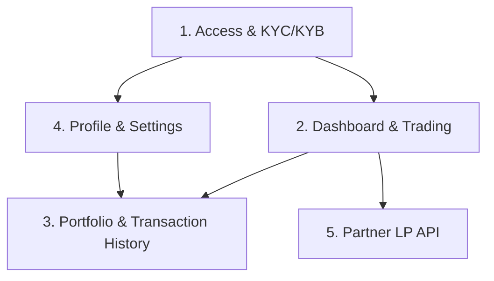

# Overview: Investor Portal & Partner LP API — Spec Index

Dokumen ini merangkum 5 spec yang sudah dibuat untuk flow investor portal frakta.io, urutan dependency-nya, dan keputusan yang masih terbuka.

## Daftar Spec

| # | Spec                                      | File                                              | Cakupan                                                                 |
|---|--------------------------------------------|-----------------------------------------------------|--------------------------------------------------------------------------|
| 1 | Access & KYC/KYB                           | `spec-investor-access-kyc-kyb.md`                   | Login Privy, 3 jalur akses (KYC personal/KYC+KYB/whitelisted), manual admin approval |
| 2 | Dashboard & Trading                        | `spec-investor-dashboard-trading.md`                | Kategori token, list, detail, 3 mode eksekusi (pancake-api/direct-swap/manual-lp) |
| 3 | Portfolio & Transaction History            | `spec-investor-portfolio-transaction-history.md`    | Holding gabungan on-chain + ledger, riwayat transaksi lintas mode         |
| 4 | Profile & Settings                         | `spec-investor-profile-settings.md`                 | Data profile read-only, resubmission KYC, wallet fixed, notification preference |
| 5 | Partner LP API                             | `spec-partner-lp-api.md`                            | B2B API — Frakta sebagai LP untuk partner, read + eksekusi buy/sell        |

## Dependency Antar Spec

- **Spec 1** adalah fondasi — semua flow lain butuh status akses & identity dari sini.
- **Spec 2** membangun `Order`, `Token`, dan `Internal LP Service` yang direuse oleh Spec 3 (transaction history) dan Spec 5 (partner order execution).
- **Spec 4** reuse state machine KYC/KYB dari Spec 1 untuk alur resubmission.
- **Spec 5** adalah yang paling independen secara UI (B2B, bukan investor-facing) tapi paling terikat secara risk ke execution mode `manual-lp` di Spec 2.

## Urutan Implementasi yang Disarankan

1. **Spec 1** (Access & KYC/KYB) — blocker untuk semua fitur lain.
2. **Spec 2** (Dashboard & Trading) — core product, terutama mode `pancake-api` dan `direct-swap` dulu (lebih sederhana) sebelum `manual-lp`.
3. **Spec 4** (Profile & Settings) — kecil, banyak reuse dari Spec 1.
4. **Spec 3** (Portfolio & Transaction History) — butuh Order table dari Spec 2 sudah settle dulu.
5. **Spec 5** (Partner LP API) — paling akhir, karena bergantung pada `manual-lp` di Spec 2 sudah matang & risk model-nya jelas.

## Keputusan yang Sudah Ditutup (per spec)

- Ketiga jalur akses (KYC personal/KYC+KYB/whitelisted) punya hak akses dashboard yang **sama** — beda hanya di proses verifikasi.
- Execution mode token (`pancake-api`/`direct-swap`/`manual-lp`) ditentukan lewat **field config per token** yang di-set admin saat listing.
- Portfolio menampilkan **kombinasi** on-chain balance + internal ledger.
- P&L **belum dihitung** di fase ini — cukup nilai holding saat ini.
- Transaction history mencakup **semua mode**, termasuk `direct-swap` yang dideteksi via on-chain indexing.
- Profile **read-only** setelah approved — perubahan lewat resubmission KYC/KYB baru.
- Wallet address **fixed sejak awal** — hanya admin yang bisa ubah.
- Notification preference fase ini **email saja**.
- Partner LP API scope: **read + eksekusi buy/sell** atas nama partner.
- Model settlement Partner LP API: **Frakta bertindak sebagai LP**, menanggung risiko harga/inventory.

## Keputusan yang Masih Terbuka

| Topik                                                              | Muncul di Spec | Status |
|---------------------------------------------------------------------|:----------------:|----------|
| Mekanisme autentikasi Partner API (API key vs OAuth2)                | 5                | **Blocker** — perlu keputusan security/bisnis sebelum development |
| Multi-wallet aggregation di portfolio (gabung semua vs per-wallet)   | 3                | Diasumsikan "gabung semua", belum dikonfirmasi |
| Kategori token: single atau multi-select per token                   | 2                | Belum diputuskan |
| Provider on-chain indexing (Alchemy/Infura/The Graph/self-hosted)     | 3                | Belum diputuskan, ada trade-off cost/latency |
| Document storage untuk file KYC/KYB (provider + enkripsi)             | 1                | Belum diputuskan |
| 2FA untuk security setting                                            | 4                | Out of scope sementara, belum diputuskan kapan masuk |
| Risk/exposure `manual-lp` (investor + partner) sebagai satu pool       | 2, 5             | Direkomendasikan direview gabungan — lihat dokumen deep-dive terpisah |

## Follow-up Spec yang Sudah Diidentifikasi (Out of Scope di masing-masing spec)

- Auto-expiry / re-KYC berkala
- Institutional multi-representative approval
- Portfolio analytics & P&L (realized/unrealized)
- Export transaction history (CSV/PDF)
- Fiat on/off-ramp
- Advanced charting
- In-app/push notification
- Self-service wallet management
- Partner self-service onboarding portal
- Revenue sharing / fee structure partner
