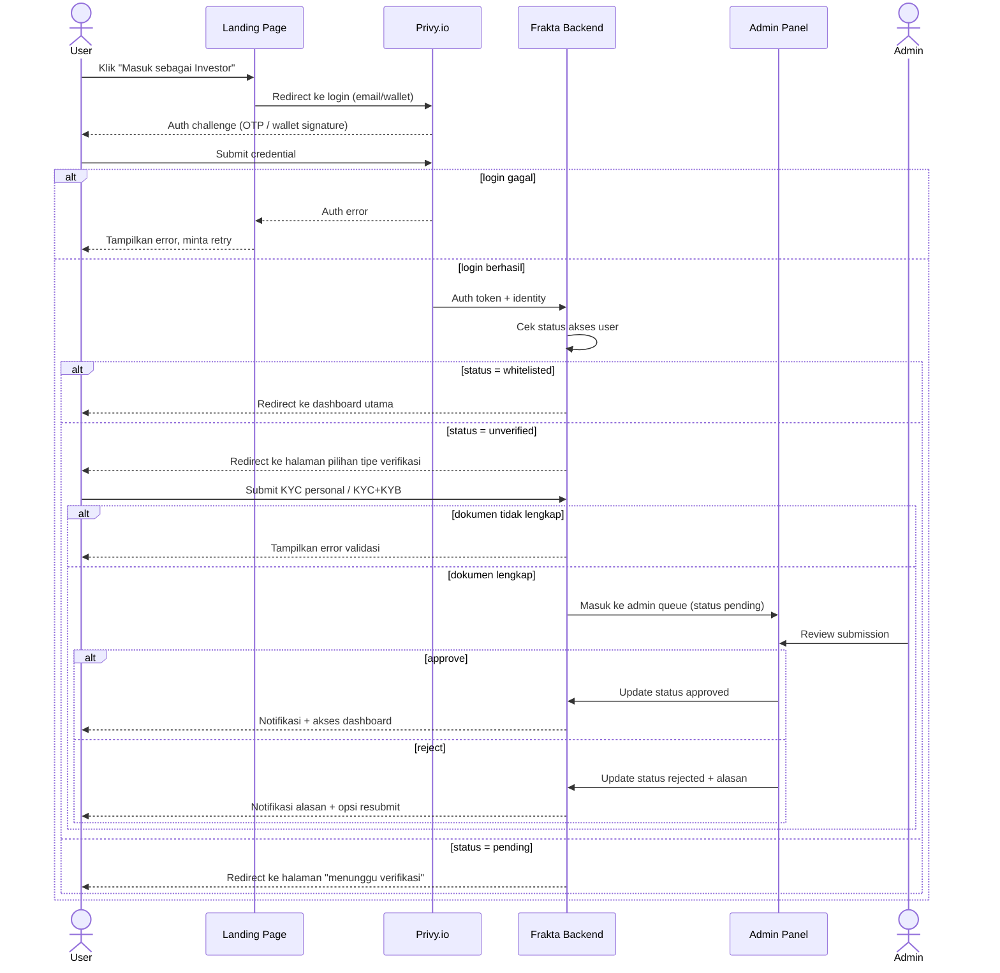

# Spec: Investor Portal Access & KYC/KYB Verification

## LAYER 1 — Functional Specification

### Overview

Saat ini belum ada gating akses ke portal investor — siapa pun yang membuka landing page berpotensi langsung masuk ke dashboard trading. Target flow: investor login via Privy.io (email/wallet), lalu diverifikasi melalui salah satu dari tiga jalur — KYC personal, KYC+KYB institutional, atau whitelisted — sebelum diberi akses ke dashboard utama. Semua proses KYC/KYB direview dan disetujui secara manual oleh admin, tanpa vendor pihak ketiga.

### User Stories

1. As an investor, I want to login with email or wallet via Privy so that I can access the platform without creating separate credentials.
2. As an investor, I want to submit KYC (personal) or KYC+KYB (institutional) so that I can be granted trading access.
3. As an admin, I want to manually review and approve/reject KYC/KYB submissions so that only verified users can access the trading portal.

### Functional Requirements

1. Sistem harus mendukung login via Privy.io menggunakan email atau wallet connect.
2. Sistem harus menentukan dan menyimpan status akses user: unverified, pending KYC, pending KYB, KYC approved, KYC+KYB approved, whitelisted, rejected.
3. User yang belum terverifikasi harus diarahkan ke halaman pilihan tipe verifikasi (personal/institutional), bukan ke dashboard utama.
4. Sistem harus membedakan form submission antara KYC personal dan KYC+KYB institutional berdasarkan pilihan tipe akun user.
5. Admin harus dapat melihat queue submission KYC/KYB berikut detail dokumen, dan mengambil aksi approve/reject dengan alasan.
6. User dengan status whitelisted harus dapat mengakses dashboard tanpa melalui proses submission KYC/KYB.
7. User berstatus rejected harus dapat resubmit dokumen tanpa membuat akun baru.
8. Sistem harus mencatat audit trail setiap perubahan status (siapa approve/reject, kapan, alasan).

### Acceptance Criteria

**Happy Path**

```
GIVEN user baru belum pernah login
WHEN user klik "Masuk sebagai Investor" dan berhasil login via Privy (email)
THEN sistem membuat user record dengan status "unverified" dan redirect ke halaman pilihan tipe verifikasi

GIVEN user login via wallet connect
WHEN signature wallet berhasil diverifikasi oleh Privy
THEN sistem memperlakukan identitas ini sama seperti session Privy lain dan melanjutkan ke pengecekan status akses

GIVEN user memilih verifikasi personal
WHEN user submit form KYC personal (data identitas + dokumen)
THEN status user berubah menjadi "pending KYC" dan submission masuk ke admin queue

GIVEN user memilih verifikasi institutional
WHEN user submit form KYC+KYB (data representative + dokumen entity)
THEN status user berubah menjadi "pending KYB" dan submission masuk ke admin queue dengan flag institutional

GIVEN admin membuka queue approval
WHEN admin approve submission KYC atau KYB
THEN status user berubah menjadi approved (KYC approved / KYC+KYB approved) dan user mendapat notifikasi serta akses dashboard utama

GIVEN wallet address atau email user terdaftar di whitelist
WHEN user login
THEN sistem otomatis menetapkan status "whitelisted" dan langsung redirect ke dashboard tanpa form KYC/KYB
```

**Error Cases**

```
GIVEN user submit form KYC dengan dokumen tidak lengkap
WHEN validasi form dijalankan
THEN sistem menolak submission, menampilkan field yang kurang, dan status tetap "unverified"

GIVEN admin reject submission dengan alasan tertentu
WHEN rejection disimpan
THEN status user berubah menjadi "rejected", user menerima notifikasi berisi alasan, dan opsi resubmit ditampilkan
```

**Edge Cases**

```
GIVEN user sudah berstatus "KYC approved" (personal)
WHEN user memilih upgrade ke institutional (KYB)
THEN sistem membuka form KYB tambahan tanpa mengulang data personal, status sementara menjadi "pending KYB" sambil akses personal tetap aktif

GIVEN user berstatus "pending KYC" atau "pending KYB"
WHEN user mencoba mengakses dashboard utama secara langsung (mis. lewat URL)
THEN sistem redirect ke halaman status "menunggu verifikasi" dan tidak mengizinkan akses trading
```

**Infra/Config**

```
GIVEN admin panel tidak dapat diakses (down)
WHEN user submit KYC/KYB
THEN submission tetap tersimpan di queue dan ditandai "pending" sampai admin panel kembali online
```

### Out of Scope

- Integrasi vendor KYC/KYB pihak ketiga (mis. Sumsub, Onfido) — approval manual sepenuhnya oleh admin di fase ini.
- Auto-expiry / re-KYC berkala untuk dokumen kedaluwarsa — follow-up spec.
- Institutional multi-representative approval (lebih dari satu representative per entity) — follow-up.
- Partner API access management (poin integrasi partner sebagai LP) — spec terpisah (Partner LP API).

---

## LAYER 2 — Technical Design

### Flow Diagram



### Data Model Changes

- **User**: `id`, `privyIdentityId`, `email`, `walletAddress`, `accountType` (personal/institutional), `accessStatus` (unverified / pending_kyc / pending_kyb / kyc_approved / kyc_kyb_approved / whitelisted / rejected), `createdAt`.
- **KycKybSubmission**: `id`, `userId`, `type` (kyc/kyb), `documents[]`, `submittedAt`, `reviewedBy`, `reviewedAt`, `decision` (approved/rejected), `rejectionReason`.
- **WhitelistEntry**: `id`, `identifier` (email atau wallet address), `addedBy`, `addedAt`.
- **AccessAuditLog**: `id`, `userId`, `fromStatus`, `toStatus`, `actor` (admin/system), `reason`, `timestamp`.

### Permission Model

| Status               | Login | Isi Form KYC/KYB | Akses Dashboard | Trading | Admin Queue |
|----------------------|:-----:|:-----------------:|:---------------:|:-------:|:-----------:|
| Unverified            | ✅    | ✅                 | ❌               | ❌      | ❌           |
| Pending KYC/KYB       | ✅    | ❌ (sudah submit)  | ❌               | ❌      | ❌           |
| KYC Approved          | ✅    | -                  | ✅               | ✅      | ❌           |
| KYC+KYB Approved      | ✅    | -                  | ✅               | ✅      | ❌           |
| Whitelisted           | ✅    | ❌ (bypass)        | ✅               | ✅      | ❌           |
| Rejected              | ✅    | ✅ (resubmit)      | ❌               | ❌      | ❌           |
| Admin                 | ✅    | -                  | ✅ (admin panel) | -       | ✅           |

Catatan: sesuai keputusan scoping, ketiga jalur approved (KYC personal, KYC+KYB, whitelisted) mendapat **hak akses dashboard & kategori token yang sama** — perbedaan hanya di proses verifikasi, bukan di permission trading.

### Business Logic

- **State machine akses**: `unverified → pending_kyc/pending_kyb → kyc_approved/kyc_kyb_approved` atau `→ rejected → (resubmit) → pending_*`. Whitelist adalah shortcut yang langsung set `whitelisted`, melewati state pending.
- **Precedence whitelist vs pending**: jika user sedang berstatus pending dan kemudian ditambahkan ke whitelist, status langsung di-override menjadi `whitelisted` pada login berikutnya (whitelist menang, submission pending yang lama ditandai closed).
- **Upgrade path**: personal → institutional adalah tambahan (additive), bukan penggantian; akses personal yang sudah approved tetap aktif selama proses KYB berjalan.
- **Resubmission**: rejection tidak menghapus user record; submission baru dibuat sebagai record baru yang terhubung ke user yang sama, riwayat rejection sebelumnya tetap tersimpan untuk audit.

### Integration Mapping

| Integrasi         | Fungsi                                             | Catatan                                   |
|-------------------|-----------------------------------------------------|--------------------------------------------|
| Privy.io           | Login email + wallet connect, identity/session token | Sudah dipakai untuk org management — reuse |
| Admin Panel (internal) | Queue review, approve/reject, document viewer   | Baru — perlu dibangun                      |
| Document Storage   | Simpan file KYC/KYB (identitas, dokumen entity)     | Perlu akses terbatas/encrypted — teknologi belum ditentukan |
| Notification (email) | Kirim notifikasi status approve/reject/resubmit    | Channel pengiriman belum ditentukan — placeholder |

### Edge Cases

- User punya beberapa wallet berbeda yang login dengan email sama — perlu klarifikasi apakah identity di-resolve berdasarkan email atau per-wallet terpisah.
- User mengganti wallet address setelah KYC personal disetujui — apakah status approval tetap melekat ke identity/email atau harus verifikasi ulang untuk wallet baru.
- Representative institutional yang sama juga ingin trading sebagai investor personal — apakah perlu dua identity terpisah atau satu identity dengan dua role.
- Admin menambahkan whitelist untuk identifier yang ternyata sudah pernah di-reject sebelumnya — whitelist override rejection.

### Error Handling

| Scenario                                         | HTTP Status | Error Code             | Retry-safe? |
|---------------------------------------------------|:-----------:|-------------------------|:------------:|
| Privy auth gagal (OTP salah / signature invalid)   | 401         | AUTH_FAILED              | Ya           |
| Form KYC/KYB submit dengan field/dokumen kurang    | 400         | KYC_VALIDATION_ERROR     | Ya           |
| User coba akses dashboard saat status pending      | 403         | ACCESS_PENDING           | Tidak (perlu approval) |
| Admin panel/service down saat submission masuk     | 503         | ADMIN_SERVICE_UNAVAILABLE | Ya (submission tetap tersimpan) |
| User coba resubmit padahal masih berstatus pending | 409         | SUBMISSION_ALREADY_PENDING | Tidak      |

### Technical Feasibility

- **Privy.io login (email/wallet)**: feasible tinggi — sudah dipakai untuk fitur organization/member management, tinggal reuse session & identity layer.
- **Admin approval panel (manual)**: feasible, tapi perlu effort UI baru untuk queue + document viewer + audit log; tidak ada dependency eksternal.
- **Document storage**: perlu keputusan teknis (storage provider + enkripsi) sebelum implementasi — flag sebagai dependency yang belum closed.
- **Whitelist matching**: sederhana, lookup table berdasarkan email/wallet address.
- **State machine status akses**: kompleksitas sedang — perlu didesain hati-hati terutama untuk path upgrade personal→institutional dan override whitelist agar tidak race condition dengan submission pending.

---

*Living document — perbarui saat implementasi mengungkap constraint baru. Acceptance criteria di atas adalah definition of done untuk fase ini.*
