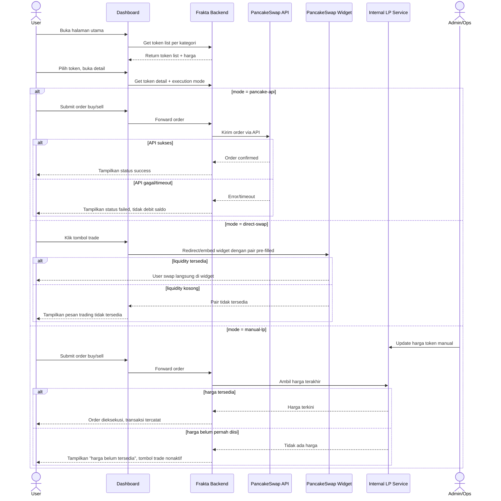

# Spec: Investor Dashboard & Trading Execution

## LAYER 1 — Functional Specification

### Overview

Setelah investor melewati gating akses (lihat spec Access & KYC/KYB), user diarahkan ke halaman utama dashboard yang menampilkan token dikelompokkan berdasarkan kategori (Stock, RWA, Stablecoin, Utility Token, dll), list token, dan halaman detail. Saat ini belum ada mekanisme eksekusi buy/sell — target: setiap token punya mode eksekusi tertentu (Pancake API, direct swap ke Pancake, atau platform bertindak sebagai LP dengan harga manual) yang ditentukan admin saat listing token.

### User Stories

1. As a verified investor, I want to browse tokens grouped by category so that I can find assets that fit my interest.
2. As an investor, I want to view a token's detail page (price, chart, stats) so that I can decide to buy or sell.
3. As an investor, I want to buy/sell a token through whichever execution method is configured for it (Pancake API, direct swap, or platform-as-LP) so that trading feels seamless regardless of the underlying liquidity source.

### Functional Requirements

1. Sistem harus menampilkan token dikelompokkan berdasarkan kategori (Stock, RWA, Stablecoin, Utility Token, dan kategori lain yang dikonfigurasi admin).
2. Sistem harus menampilkan list token per kategori dengan info ringkas (harga terkini, perubahan 24 jam, mini chart).
3. Sistem harus menyediakan halaman detail token berisi harga, statistik, dan riwayat chart.
4. Setiap token harus memiliki field konfigurasi execution mode (`pancake-api` / `direct-swap` / `manual-lp`) yang di-set admin saat listing.
5. Untuk token bermode `pancake-api`, sistem harus meneruskan order buy/sell ke PancakeSwap melalui API tanpa user meninggalkan platform.
6. Untuk token bermode `direct-swap`, sistem harus mengarahkan user ke widget/link swap PancakeSwap dengan pair token sudah pre-filled.
7. Untuk token bermode `manual-lp`, sistem harus menyimpan harga token yang diupdate manual oleh admin/ops, dan mengeksekusi order investor terhadap harga tersebut.
8. Sistem harus memblokir aksi trading untuk user yang status aksesnya belum approved.

### Acceptance Criteria

**Happy Path**

```
GIVEN user berstatus akses approved
WHEN user membuka halaman utama
THEN sistem menampilkan token dikelompokkan per kategori sesuai konfigurasi admin

GIVEN user memilih salah satu kategori
WHEN list token dimuat
THEN sistem menampilkan token yang sesuai kategori dengan harga dan perubahan 24 jam

GIVEN token dikonfigurasi mode "pancake-api"
WHEN user submit order buy pada halaman detail
THEN sistem mengirim request ke PancakeSwap API dan menampilkan status transaksi (pending/success/failed)

GIVEN token dikonfigurasi mode "direct-swap"
WHEN user klik tombol trade pada halaman detail
THEN sistem membuka widget/link PancakeSwap dengan pair token yang sudah pre-filled

GIVEN token dikonfigurasi mode "manual-lp"
WHEN user submit order buy/sell
THEN sistem mengeksekusi order terhadap harga LP internal terakhir yang diupdate admin dan mencatat transaksi
```

**Error Cases**

```
GIVEN token bermode "pancake-api"
WHEN request ke PancakeSwap API gagal atau timeout
THEN sistem menampilkan status order "failed" dan tidak mendebit saldo user

GIVEN token bermode "manual-lp"
WHEN admin belum pernah mengisi harga token
THEN sistem menampilkan token sebagai "harga belum tersedia" dan menonaktifkan tombol trade
```

**Edge Cases**

```
GIVEN token bermode "direct-swap"
WHEN pair token tidak tersedia di PancakeSwap (liquidity kosong)
THEN sistem menampilkan pesan bahwa trading sementara tidak tersedia untuk token ini

GIVEN admin mengubah execution mode token dari "manual-lp" ke "pancake-api"
WHEN perubahan disimpan sementara ada order yang masih pending di mode lama
THEN sistem harus menyelesaikan/menolak order lama terlebih dahulu sebelum mode baru berlaku
```

**Infra/Config**

```
GIVEN koneksi ke PancakeSwap API terputus
WHEN user membuka token bermode "pancake-api"
THEN sistem menampilkan indikator harga sebagai "delayed/unavailable" dan tidak mengizinkan order baru
```

### Out of Scope

- Partner-facing API untuk expose data token, market, dan buy/sell ke pihak ketiga (poin integrasi partner sebagai LP) — akan dibuat sebagai spec terpisah (Partner LP API).
- Portfolio/holdings dashboard user secara detail — follow-up.
- Advanced charting (multi-timeframe, technical indicators) — follow-up, fase ini cukup chart dasar.
- Fiat on/off-ramp — belum dibahas, follow-up jika diperlukan.

---

## LAYER 2 — Technical Design

### Flow Diagram



### Data Model Changes

- **Token**: `id`, `symbol`, `name`, `category` (stock/rwa/stablecoin/utility/other), `executionMode` (pancake-api/direct-swap/manual-lp), `pancakePairAddress` (nullable), `status` (active/inactive), `createdBy`, `updatedAt`.
- **TokenPriceManual**: `id`, `tokenId`, `price`, `updatedBy`, `updatedAt` — riwayat harga untuk token bermode `manual-lp`.
- **Order**: `id`, `userId`, `tokenId`, `side` (buy/sell), `executionMode` (snapshot saat order dibuat), `amount`, `price`, `status` (pending/success/failed), `externalRef` (tx hash / Pancake order id), `createdAt`.
- **TokenCategory**: `id`, `name`, `slug`, `order` — dikonfigurasi admin, bukan hardcode.

### Permission Model

| Aksi                              | Investor (approved) | Investor (pending/unverified) | Admin/Ops |
|-----------------------------------|:--------------------:|:-------------------------------:|:---------:|
| Lihat dashboard & list token       | ✅                    | ❌                               | ✅        |
| Lihat detail token                 | ✅                    | ❌                               | ✅        |
| Submit order buy/sell              | ✅                    | ❌                               | ❌        |
| Set/ubah execution mode token      | ❌                    | ❌                               | ✅        |
| Update harga manual (mode LP)      | ❌                    | ❌                               | ✅        |
| Tambah/ubah kategori token         | ❌                    | ❌                               | ✅        |

### Business Logic

- **Penentuan execution mode**: di-set admin sebagai field pada token saat listing (bukan otomatis dari kategori) — memungkinkan dua token dalam kategori sama punya mode eksekusi berbeda.
- **Snapshot mode pada order**: setiap order menyimpan execution mode saat order dibuat, agar perubahan mode admin di tengah jalan tidak mengubah cara order lama diproses.
- **Migrasi mode token**: order pending pada mode lama harus selesai (settled/cancelled) sebelum mode baru aktif untuk order baru — mencegah satu token diproses dua sistem settlement berbeda secara bersamaan.
- **Manual LP price**: harga tersimpan sebagai riwayat (bukan overwrite), sehingga ada jejak siapa & kapan update harga — penting untuk audit dan mendeteksi fat-finger.
- **Kategori dinamis**: kategori token dikonfigurasi admin (bukan hardcode di kode), agar kategori baru (mis. token jenis baru) bisa ditambahkan tanpa deploy ulang.

### Integration Mapping

| Integrasi              | Fungsi                                            | Catatan                                       |
|-------------------------|-----------------------------------------------------|------------------------------------------------|
| PancakeSwap API          | Eksekusi order buy/sell untuk mode `pancake-api`     | Perlu API key/credential, rate limit belum diketahui |
| PancakeSwap Swap Widget  | Redirect/embed untuk mode `direct-swap`              | Paling sederhana, dependency minimal            |
| Internal LP Service      | Simpan & serve harga manual untuk mode `manual-lp`   | Baru — perlu dibangun, termasuk audit log harga |
| Wallet (MetaMask)        | Settlement on-chain untuk transaksi buy/sell         | Sudah dipakai di flow ownership transfer        |
| Market Data (internal)   | Data harga/statistik untuk kategori Stock/RWA        | Sumber data belum ditentukan — perlu klarifikasi lanjutan |

### Edge Cases

- Token yang sama ingin masuk lebih dari satu kategori (mis. RWA sekaligus Stock) — perlu keputusan apakah kategori bersifat single atau multi-select.
- Race condition: dua investor submit order bersamaan pada token `manual-lp` tepat saat admin update harga — order mana yang pakai harga lama vs baru.
- Admin salah input harga (fat-finger) pada mode `manual-lp` — perlu guard rail (mis. batas persentase perubahan maksimum per update).
- User submit order saat token sedang dalam proses migrasi execution mode — order harus ditolak sementara, bukan diproses dengan mode ambigu.
- PancakeSwap pair address salah/tidak valid saat admin listing token mode `pancake-api`/`direct-swap` — validasi saat setup, bukan saat user trading.

### Error Handling

| Scenario                                              | HTTP Status | Error Code              | Retry-safe? |
|--------------------------------------------------------|:-----------:|---------------------------|:------------:|
| PancakeSwap API timeout/gagal saat order                | 502         | PANCAKE_API_ERROR          | Ya           |
| Order manual-lp saat harga belum diisi admin             | 409         | LP_PRICE_NOT_SET           | Tidak        |
| Order pada token yang sedang migrasi execution mode       | 409         | TOKEN_MODE_MIGRATION       | Ya (setelah migrasi selesai) |
| Pair tidak ditemukan di PancakeSwap (direct-swap/API)     | 404         | PANCAKE_PAIR_NOT_FOUND     | Tidak        |
| User trading tanpa status akses approved                  | 403         | ACCESS_NOT_APPROVED        | Tidak        |

### Technical Feasibility

- **Kategori & listing token**: feasible tinggi, murni CRUD + konfigurasi admin.
- **Mode `direct-swap`**: paling sederhana secara teknis — embed/link widget PancakeSwap, minim dependency backend.
- **Mode `pancake-api`**: kompleksitas sedang-tinggi — perlu handle slippage, gas estimation, error/timeout handling, dan kemungkinan custody/approval wallet di sisi platform untuk eksekusi atas nama user.
- **Mode `manual-lp`**: paling kompleks dan paling berisiko — platform bertindak sebagai counterparty (LP), artinya perlu ledger internal, settlement logic, dan kemungkinan kebutuhan modal/inventory serta review compliance (karena platform menanggung risiko harga, bukan sekadar pass-through). Ini perlu dikaji lebih lanjut dari sisi legal/finance sebelum implementasi, di luar sekadar technical build.

---

*Living document — perbarui saat implementasi mengungkap constraint baru. Acceptance criteria di atas adalah definition of done untuk fase ini. Partner LP API (poin 7 dari flow awal) akan dibuatkan spec terpisah setelah flow ini closed.*
