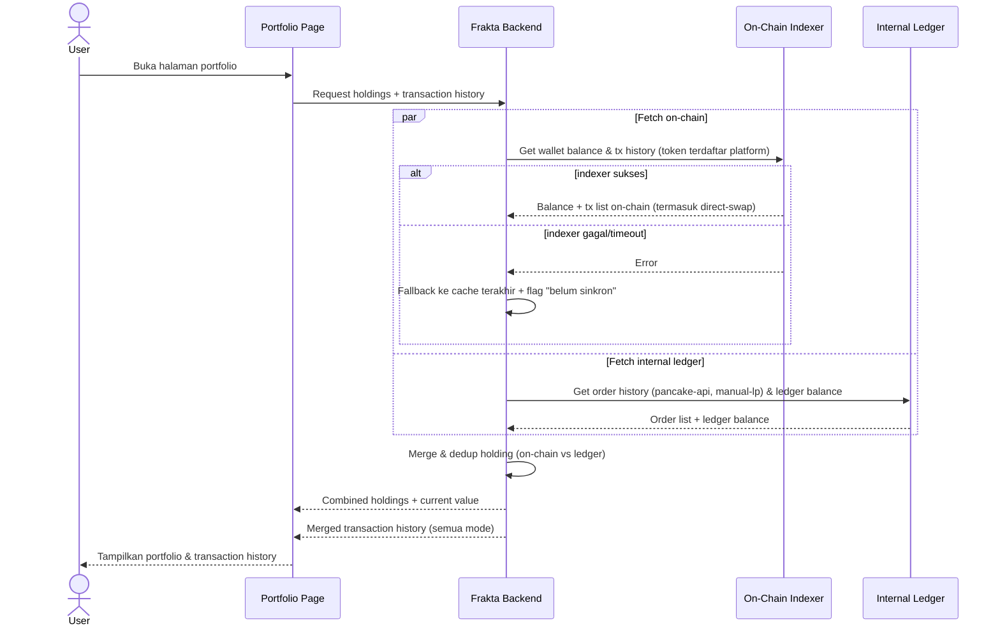

# Spec: Investor Portfolio & Transaction History

## LAYER 1 — Functional Specification

### Overview

Saat ini investor tidak punya cara melihat holding token yang dimiliki atau riwayat transaksi trading mereka. Target: halaman Portfolio menampilkan holding gabungan antara on-chain wallet balance dan internal ledger (untuk token `manual-lp`) beserta nilai saat ini, dan halaman Transaction History menampilkan seluruh transaksi user lintas ketiga execution mode (`pancake-api`, `direct-swap`, `manual-lp`) — termasuk transaksi `direct-swap` yang terjadi di luar platform, yang dideteksi lewat on-chain indexing. P&L belum dihitung di fase ini.

### User Stories

1. As an investor, I want to see my current token holdings (combining on-chain balance and internal ledger) so that I know what I own and its current value.
2. As an investor, I want to see my transaction history across all execution modes so that I have a complete record of my trading activity, including trades I made directly via the swap widget.
3. As an investor, I want to filter my transaction history by token, mode, or date so that I can find specific transactions easily.

### Functional Requirements

1. Sistem harus menampilkan daftar holding token milik user, gabungan dari on-chain wallet balance dan internal ledger (untuk token `manual-lp`).
2. Sistem harus menghitung nilai holding saat ini berdasarkan harga terkini token, sesuai sumber harga masing-masing execution mode.
3. Sistem harus menampilkan transaction history yang mencakup transaksi dari ketiga execution mode (`pancake-api`, `direct-swap`, `manual-lp`).
4. Untuk transaksi `direct-swap` yang terjadi di luar platform, sistem harus mendeteksi dan mencatatnya melalui on-chain indexing terhadap wallet address user yang terhubung.
5. Sistem harus menampilkan status tiap transaksi (pending/success/failed) beserta detail (token, side, amount, price, timestamp, execution mode).
6. Sistem harus mendukung filter transaction history berdasarkan token, execution mode, dan rentang tanggal.
7. Sistem harus me-refresh on-chain balance secara berkala (polling) dan saat user membuka halaman portfolio.
8. Sistem tidak menghitung P&L (realized/unrealized) pada fase ini — hanya nilai holding saat ini.

### Acceptance Criteria

**Happy Path**

```
GIVEN user approved memiliki token di wallet dan/atau internal ledger
WHEN user membuka halaman portfolio
THEN sistem menampilkan holding gabungan dengan quantity dan current value per token

GIVEN user melakukan swap "direct-swap" di luar platform (langsung di widget PancakeSwap)
WHEN sistem melakukan on-chain indexing terhadap wallet user
THEN transaksi tersebut muncul di transaction history dengan execution mode "direct-swap"

GIVEN user melakukan order via "pancake-api" atau "manual-lp"
WHEN order berstatus success
THEN transaksi otomatis tercatat di transaction history tanpa bergantung pada on-chain indexing

GIVEN user menerapkan filter (token/mode/date range) pada transaction history
WHEN filter dijalankan
THEN sistem hanya menampilkan transaksi yang sesuai kriteria
```

**Error Cases**

```
GIVEN on-chain indexing service gagal atau timeout
WHEN user membuka halaman portfolio
THEN sistem tetap menampilkan data dari internal ledger dengan indikator "on-chain data belum sinkron"

GIVEN harga token tidak tersedia (mis. manual-lp belum pernah diisi admin)
WHEN sistem menghitung current value holding
THEN sistem menampilkan value sebagai "N/A", bukan 0 atau error
```

**Edge Cases**

```
GIVEN user memindahkan token keluar wallet secara langsung (mis. via MetaMask, bukan lewat platform)
WHEN portfolio di-refresh
THEN sistem menampilkan balance terbaru sesuai on-chain state, bukan data lama yang sudah stale

GIVEN token yang sama punya representasi baik di on-chain maupun internal ledger (mis. token manual-lp yang juga sudah di-mint on-chain)
WHEN sistem menggabungkan data holding
THEN sistem harus menerapkan aturan dedup agar tidak terjadi double count
```

**Infra/Config**

```
GIVEN RPC provider untuk on-chain indexing sedang down
WHEN sistem mencoba fetch balance
THEN sistem fallback ke data cache terakhir dengan timestamp "last synced" yang ditampilkan ke user
```

### Out of Scope

- P&L (realized/unrealized) — follow-up spec.
- Portfolio analytics (allocation chart, performance over time) — follow-up.
- Export transaction history (CSV/PDF) — follow-up jika diminta.
- Tax reporting — follow-up.

---

## LAYER 2 — Technical Design

### Flow Diagram



### Data Model Changes

- **TokenHoldingCache**: `id`, `userId`, `tokenId`, `onChainBalance`, `internalLedgerBalance`, `combinedBalance`, `currentValue`, `lastSyncedAt`.
- **TransactionRecord**: `id`, `userId`, `tokenId`, `source` (`on-chain-indexed` / `internal-order`), `executionMode`, `side`, `amount`, `price`, `status`, `txHash` (nullable), `orderId` (nullable, referensi ke Order pada spec Dashboard & Trading), `timestamp`.
- **WalletLink**: `id`, `userId`, `walletAddress`, `linkedVia` (privy), `addedAt` — mendukung agregasi multi-wallet per user.

### Permission Model

| Aksi                                  | Investor (approved) | Investor (pending/unverified) | Admin/Ops |
|-----------------------------------------|:---------------------:|:--------------------------------:|:-----------:|
| Lihat portfolio milik sendiri            | ✅                     | ❌                                | -           |
| Lihat transaction history milik sendiri  | ✅                     | ❌                                | -           |
| Lihat portfolio user lain (support)      | ❌                     | ❌                                | ✅ (read-only, untuk keperluan support) |
| Filter transaction history               | ✅                     | ❌                                | ✅          |

### Business Logic

- **Merge/dedup rule**: token yang settlement-nya murni on-chain (`pancake-api`, `direct-swap`) dihitung dari on-chain balance sebagai source of truth. Token `manual-lp` yang belum di-mint on-chain dihitung dari internal ledger. Jika sebuah token `manual-lp` sudah punya representasi on-chain dan sudah tersinkron, on-chain balance yang jadi source of truth (internal ledger tidak dihitung ganda).
- **Multi-wallet aggregation**: portfolio mengagregasi seluruh wallet address yang terhubung ke user via Privy (bukan per-wallet view terpisah) — *asumsi default, perlu dikonfirmasi kalau ternyata investor ingin melihat breakdown per-wallet*.
- **On-chain indexing scope**: indexer hanya melacak token contract address yang terdaftar di platform (bukan seluruh isi wallet user), untuk menghindari noise dari token yang tidak relevan.
- **Sync cadence**: balance di-refresh via polling interval (interval belum ditentukan — default awal disarankan tiap beberapa menit) dan on-demand saat user membuka halaman portfolio.
- **Reconciliation transaction history**: setiap transaksi internal (`pancake-api`, `manual-lp`) langsung tercatat saat order selesai; transaksi `direct-swap` hanya muncul setelah proses indexing berikutnya berjalan (bukan instan).

### Integration Mapping

| Integrasi               | Fungsi                                                  | Catatan                                    |
|---------------------------|------------------------------------------------------------|-----------------------------------------------|
| On-chain Indexer/RPC       | Baca wallet balance & transaksi `direct-swap`                | Provider belum ditentukan (mis. Alchemy/Infura/The Graph) |
| Internal Ledger (Order)    | Sumber transaksi `pancake-api` & `manual-lp`                  | Reuse dari spec Dashboard & Trading            |
| Price Feed                 | Hitung current value holding                                  | Reuse dari token detail (spec Dashboard & Trading) |
| Privy.io                   | Daftar wallet address yang terhubung ke user untuk agregasi   | Reuse dari spec Access & KYC/KYB               |

### Edge Cases

- User punya lebih dari satu wallet terhubung — perlu dipastikan agregasi bekerja benar tanpa duplikasi balance antar wallet.
- Token migrasi contract address (re-deploy) — transaction history lama mereferensikan address lama, perlu mapping historis.
- Token di-delist dari platform tapi user masih memegang balance on-chain — perlu keputusan apakah tetap ditampilkan di portfolio atau disembunyikan dari listing tapi tetap muncul di holding.
- Indexer delay menyebabkan transaksi `direct-swap` yang baru terjadi belum muncul saat user cek — perlu indikator "sedang sinkronisasi" agar user tidak mengira transaksi hilang.

### Error Handling

| Scenario                                                | HTTP Status | Error Code                | Retry-safe? |
|------------------------------------------------------------|:-----------:|------------------------------|:------------:|
| On-chain indexer/RPC gagal atau timeout                      | 503         | ONCHAIN_INDEXER_UNAVAILABLE   | Ya           |
| Harga token tidak tersedia saat hitung current value          | 200 (partial) | PRICE_UNAVAILABLE            | Ya (tampil "N/A") |
| Filter transaction history dengan parameter tidak valid       | 400         | INVALID_FILTER_PARAMS         | Ya           |
| User request portfolio user lain tanpa role admin             | 403         | FORBIDDEN_PORTFOLIO_ACCESS    | Tidak        |

### Technical Feasibility

- **On-chain indexing**: feasible, tapi perlu pemilihan provider (Alchemy/Infura/The Graph atau self-hosted node) — ada trade-off cost vs latency vs reliability yang perlu dievaluasi terpisah.
- **Dedup logic on-chain vs manual-lp ledger**: kompleksitas sedang — perlu source-of-truth rule yang jelas dan diuji, terutama saat token pindah dari murni manual-lp menjadi juga tersedia on-chain.
- **Multi-wallet aggregation**: feasible, sudah didukung struktur data WalletLink; perlu UI tambahan kalau nanti diminta breakdown per-wallet.
- **Polling-based balance refresh**: feasible dengan biaya RPC call yang perlu dipantau (rate limit provider).

---

*Living document — perbarui saat implementasi mengungkap constraint baru. Acceptance criteria di atas adalah definition of done untuk fase ini. Selanjutnya: spec Profile & Settings, lalu Partner LP API.*
