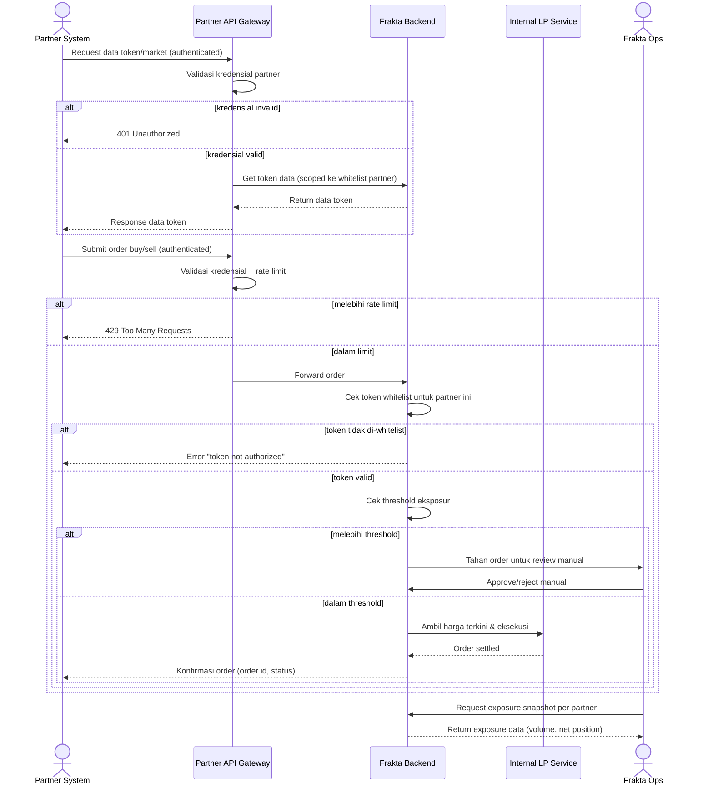

# Spec: Partner LP API Integration

## LAYER 1 — Functional Specification

### Overview

Partner eksternal ingin menggunakan Frakta sebagai liquidity provider untuk token yang mereka listing di platform mereka sendiri. Saat ini belum ada API yang membuka akses tersebut. Target: Frakta menyediakan API bagi partner untuk mengambil data token/market dan mengirim order buy/sell atas nama partner, di mana **Frakta bertindak sebagai LP** (menanggung risiko harga & inventory) — partner hanya mengonsumsi data dan mengeksekusi order, tanpa menanggung risiko harga sendiri.

### User Stories

1. As a partner platform, I want to fetch token & market data via API so that I can display Frakta-backed assets on my own platform.
2. As a partner platform, I want to submit buy/sell orders via API so that trades execute against Frakta's liquidity on behalf of my users.
3. As Frakta ops, I want to monitor and control partner API usage and exposure so that risk stays within acceptable limits.

### Functional Requirements

1. Sistem harus menyediakan API bagi partner untuk mengambil data token (harga, kategori, statistik) yang tersedia untuk mereka.
2. Sistem harus menyediakan API bagi partner untuk submit order buy/sell atas nama partner tersebut.
3. Sistem harus mengautentikasi setiap request partner API (mekanisme spesifik belum diputuskan — lihat catatan di Technical Feasibility).
4. Setiap partner harus terdaftar sebagai entity terpisah dengan daftar token yang secara eksplisit di-whitelist untuk mereka.
5. Sistem harus mencatat setiap order dari partner API sebagai transaksi terpisah dari transaksi investor platform, dengan atribusi partner yang jelas.
6. Sistem, sebagai LP, harus mengeksekusi order partner terhadap harga internal menggunakan mekanisme yang sama dengan execution mode `manual-lp` pada dashboard investor.
7. Sistem harus menerapkan rate limiting per partner untuk mencegah penyalahgunaan/overload.
8. Sistem harus memungkinkan Frakta ops memantau eksposur (total volume/posisi) per partner secara near real-time.

### Acceptance Criteria

**Happy Path**

```
GIVEN partner terdaftar dan request-nya terautentikasi
WHEN partner request data token/market
THEN sistem mengembalikan data token yang di-whitelist untuk partner tersebut saja

GIVEN partner submit order buy/sell via API
WHEN order valid (partner terautentikasi, token di-whitelist, dalam batas limit)
THEN sistem mengeksekusi order terhadap harga LP internal dan mengembalikan konfirmasi order (order id, status)

GIVEN order dari partner berhasil dieksekusi
WHEN dicatat ke sistem
THEN transaksi tersimpan dengan atribusi partner, terpisah dari transaksi investor platform
```

**Error Cases**

```
GIVEN partner request dengan kredensial tidak valid/kedaluwarsa
WHEN request diterima
THEN sistem menolak dengan status unauthorized tanpa mengekspos data apa pun

GIVEN partner submit order untuk token yang tidak di-whitelist untuk mereka
WHEN order diterima
THEN sistem menolak order dengan error "token not authorized for this partner"

GIVEN partner melebihi rate limit
WHEN request masuk
THEN sistem menolak request dengan status too-many-requests beserta informasi retry-after
```

**Edge Cases**

```
GIVEN partner submit order dalam volume yang jauh melebihi batas eksposur normal
WHEN order diterima
THEN sistem menahan order untuk review manual (circuit breaker), bukan langsung dieksekusi otomatis

GIVEN harga token manual-lp sedang diupdate admin bersamaan dengan partner submit order
WHEN order diproses
THEN sistem menangani race condition dengan aturan yang sama seperti order investor manual-lp (order menggunakan harga valid terkini, bukan harga stale)
```

**Infra/Config**

```
GIVEN partner API service sedang down/maintenance
WHEN partner request masuk
THEN sistem mengembalikan status service-unavailable beserta estimasi waktu pemulihan, tidak silent fail
```

### Out of Scope

- Mekanisme autentikasi final (API key vs OAuth2 dengan scope) — perlu keputusan bisnis/security sebelum implementasi; spec ini memperlakukannya sebagai "authenticated request" generik.
- Partner self-service onboarding portal — follow-up; onboarding awal dilakukan manual oleh admin.
- Revenue sharing / fee structure antara Frakta dan partner — follow-up, ranah bisnis bukan teknis.
- Multi-currency settlement dengan partner — follow-up.

---

## LAYER 2 — Technical Design

### Flow Diagram



### Data Model Changes

- **Partner**: `id`, `name`, `apiCredentialRef` (placeholder — mekanisme kredensial belum ditentukan), `status` (active/suspended), `createdAt`.
- **PartnerTokenWhitelist**: `id`, `partnerId`, `tokenId`.
- **PartnerOrder**: `id`, `partnerId`, `tokenId`, `side`, `amount`, `price`, `status`, `externalPartnerRef` (referensi order/user milik partner, opaque bagi Frakta), `createdAt`.
- **PartnerExposureSnapshot**: `id`, `partnerId`, `totalVolume`, `netPosition`, `snapshotAt`.

### Permission Model

| Aksi                                          | Partner | Frakta Ops |
|----------------------------------------------------|:---------:|:------------:|
| Ambil data token yang di-whitelist untuk mereka       | ✅        | ✅ (semua partner) |
| Ambil data token milik partner lain                    | ❌        | ✅            |
| Submit order buy/sell untuk token yang di-whitelist    | ✅        | -             |
| Submit order untuk token di luar whitelist mereka      | ❌        | -             |
| Kelola whitelist token per partner                     | ❌        | ✅            |
| Lihat/monitor exposure snapshot                         | ❌ (hanya milik sendiri, jika disediakan) | ✅ (semua partner) |
| Suspend/reaktivasi partner                              | ❌        | ✅            |

### Business Logic

- **Reuse manual-lp execution**: order dari partner API dieksekusi lewat mekanisme internal yang sama dengan `manual-lp` pada dashboard investor — sumber order berbeda (API partner vs UI investor), tapi logic settlement & harga sama.
- **Whitelist enforcement**: partner hanya dapat bertransaksi pada token yang secara eksplisit di-assign ke mereka; tidak ada akses default ke seluruh katalog token.
- **Exposure circuit breaker**: order yang melebihi threshold eksposur tertentu ditahan untuk review manual sebelum settle — karena Frakta menanggung risiko harga sebagai LP, bukan sekadar pass-through.
- **Rate limiting per partner**: limit dikonfigurasi per partner (bukan flat global), agar bisa disesuaikan dengan tier/kesepakatan bisnis masing-masing partner.
- **Atribusi transaksi terpisah**: order partner dicatat di entity terpisah (`PartnerOrder`) dari `Order` milik investor platform, meski keduanya sama-sama settle lewat Internal LP Service.

### Integration Mapping

| Integrasi                  | Fungsi                                                   | Catatan                                       |
|--------------------------------|---------------------------------------------------------------|--------------------------------------------------|
| Internal LP Service (existing)   | Eksekusi order partner menggunakan harga manual-lp              | Reuse dari spec Dashboard & Trading               |
| Partner API Gateway (baru)       | Autentikasi, rate limiting, routing request partner             | Baru — perlu dibangun                            |
| Ops Monitoring Dashboard (baru)  | Pantau exposure per partner, approve/reject order yang ditahan  | Baru — perlu dibangun                            |

### Edge Cases

- Token yang di-whitelist untuk partner kemudian di-delist dari platform Frakta — perlu keputusan bagaimana order partner yang masih pending diperlakukan.
- Dua partner berbeda mengakses token yang sama dengan volume besar secara bersamaan — perlu mekanisme agregasi eksposur lintas partner per token, bukan hanya limit per-partner secara terpisah.
- Kredensial API partner bocor/disalahgunakan — perlu mekanisme revoke/rotate kredensial secara cepat begitu mekanisme auth diputuskan.

### Error Handling

| Scenario                                                  | HTTP Status | Error Code                    | Retry-safe? |
|----------------------------------------------------------------|:-----------:|----------------------------------|:------------:|
| Kredensial partner tidak valid/kedaluwarsa                       | 401         | PARTNER_AUTH_FAILED               | Ya (setelah re-auth) |
| Order untuk token yang tidak di-whitelist partner                | 403         | TOKEN_NOT_AUTHORIZED_FOR_PARTNER  | Tidak        |
| Partner melebihi rate limit                                       | 429         | PARTNER_RATE_LIMIT_EXCEEDED       | Ya (setelah retry-after) |
| Order melebihi threshold eksposur, ditahan untuk review            | 202 (accepted, pending review) | PARTNER_ORDER_PENDING_REVIEW | Tidak (menunggu keputusan ops) |
| Partner API Gateway down/maintenance                              | 503         | PARTNER_API_UNAVAILABLE           | Ya           |

### Technical Feasibility

- **Partner-facing API Gateway**: effort baru signifikan — perlu auth layer, rate limiting, dan dokumentasi partner-facing.
- **Reuse manual-lp execution logic**: mengurangi kompleksitas karena tinggal extend Internal LP Service yang sudah ada di spec Dashboard & Trading, bukan membangun settlement engine baru.
- **Mekanisme autentikasi**: ini **blocker keputusan**, bukan sekadar detail implementasi — API key sederhana (server-to-server) lebih cepat dibangun tapi lebih lemah dari sisi security/scope control dibanding OAuth2; perlu keputusan bareng tim security sebelum development dimulai.
- **Exposure/risk monitoring**: mendekati risk management system, bukan sekadar CRUD — effort tambahan di luar core trading, kemungkinan perlu keterlibatan tim risk/finance.
- **Implikasi bisnis**: karena Frakta menanggung risiko sebagai LP untuk partner (mirip dengan `manual-lp` investor), disarankan eksposur partner dan eksposur investor manual-lp direview sebagai satu risk pool agregat, bukan disilo per fitur — supaya total exposure Frakta sebagai LP terlihat utuh.

---

*Living document — perbarui saat implementasi mengungkap constraint baru. Acceptance criteria di atas adalah definition of done untuk fase ini.*
