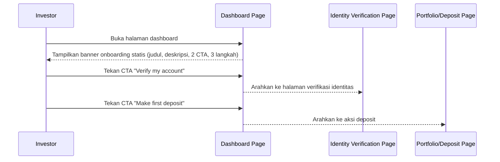

# Spec: Dashboard Onboarding Banner

## LAYER 1 — Functional Specification

### Overview

Sebelumnya dashboard menampilkan banner "Initial Offering" yang isinya diambil dari data aset (nama, harga aset unggulan) — copy-nya sempat tidak sinkron dengan aset yang ditautkan. Spec ini mendefinisikan banner pengganti: pesan kampanye statis yang mengarahkan investor baru melalui tiga langkah onboarding (verifikasi identitas, deposit, beli fraksi pertama), dengan dua CTA menuju langkah pertama dan kedua.

### User Stories

1. As a new investor yang belum verifikasi, I want melihat langkah selanjutnya yang jelas begitu masuk dashboard, so that saya tahu harus mulai dari mana tanpa menebak.
2. As an investor, I want menekan CTA banner untuk langsung ke halaman verifikasi identitas atau ke deposit, so that saya bisa lanjut onboarding tanpa mencari menu terkait sendiri.

### Functional Requirements

1. Sistem harus menampilkan banner dengan pesan kampanye statis (bukan diturunkan dari data aset manapun) di bagian atas halaman dashboard.
2. Sistem harus menampilkan urutan tiga langkah onboarding (verifikasi identitas, deposit, beli fraksi pertama) sebagai penanda progres bernomor pada banner.
3. Sistem harus menyediakan CTA yang mengarahkan investor ke halaman verifikasi identitas.
4. Sistem harus menyediakan CTA kedua yang mengarahkan investor ke aksi deposit.
5. Sistem harus menampilkan banner ini secara konsisten terlepas dari status verifikasi atau kepemilikan aset investor saat ini.

### Acceptance Criteria

**Happy Path**
- [ ] GIVEN investor membuka halaman dashboard, WHEN halaman selesai dimuat, THEN sistem menampilkan banner kampanye onboarding dengan judul, deskripsi, dua CTA, dan tiga langkah bernomor.
- [ ] GIVEN investor melihat banner, WHEN investor menekan CTA pertama, THEN sistem mengarahkan investor ke halaman verifikasi identitas.
- [ ] GIVEN investor melihat banner, WHEN investor menekan CTA kedua, THEN sistem mengarahkan investor ke aksi deposit.

**Edge Cases**
- [ ] GIVEN investor sudah menyelesaikan verifikasi identitas dan memiliki aset, WHEN investor membuka dashboard, THEN sistem tetap menampilkan banner onboarding yang sama tanpa personalisasi berdasarkan status tersebut.

### Out of Scope

- Menyembunyikan atau mengganti isi banner berdasarkan status onboarding investor (misal disembunyikan setelah verifikasi selesai) — follow-up spec terpisah bila dibutuhkan personalisasi.
- Melacak progres investor pada tiap langkah (verifikasi/deposit/beli) untuk menandai langkah mana yang sudah selesai pada banner — follow-up spec terpisah.
- A/B testing atau rotasi copy banner — follow-up bila dibutuhkan.

---

## LAYER 2 — Technical Design

### Flow Diagram

### Data Model Changes

No schema changes — banner adalah konten statis, tidak diturunkan dari entitas Asset atau entitas lain manapun.

### Error Handling

| Scenario | HTTP Status | Error Code | Retry-safe? |
|---|---|---|---|
| N/A — banner statis tanpa fetch data eksternal, tidak ada state gagal yang berlaku | — | — | — |
