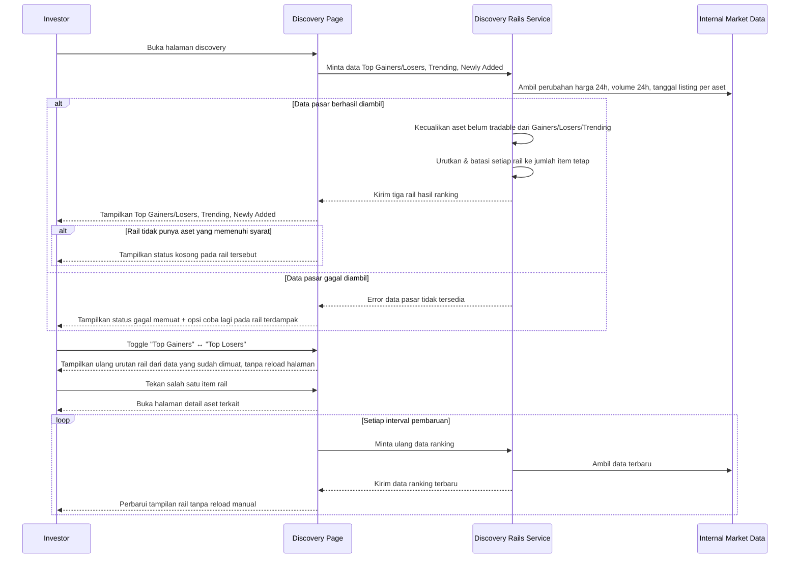

# Spec: Market Discovery Rails (Top Gainers/Losers, Trending, Newly Added)

## LAYER 1 — Functional Specification

### Overview

Investor yang membuka halaman discovery saat ini harus menyisir seluruh katalog aset secara manual untuk menemukan mana yang sedang bergerak atau baru terdaftar. Spec ini mendefinisikan tiga rail ringkasan yang dihitung otomatis dari data pasar internal: **Top Gainers/Top Losers** (toggle dalam satu kartu, berdasarkan perubahan harga 24 jam), **Trending** (berdasarkan volume transaksi 24 jam tertinggi), dan **Newly Added** (aset yang paling baru terdaftar). Ketiganya tampil sebagai rail ringkas di halaman discovery, memberi investor sinyal cepat tanpa harus membuka setiap aset satu per satu.

### User Stories

1. As an investor, I want to see which assets gained or lost the most value in the last 24 hours, so that I can spot market movers without scanning the full catalog.
2. As an investor, I want to see which assets have the highest recent trading activity, so that I can find markets with real momentum.
3. As an investor, I want to see the most recently listed assets, so that I can discover new opportunities as soon as they become available.

### Functional Requirements

1. Sistem harus menghitung ranking Top Gainers dan Top Losers berdasarkan persentase perubahan harga 24 jam terakhir tiap aset yang sudah tradable.
2. Sistem harus mengizinkan investor beralih (toggle) antara tampilan Top Gainers dan Top Losers dalam satu kartu yang sama tanpa memuat ulang halaman.
3. Sistem harus menghitung ranking Trending berdasarkan volume transaksi 24 jam terakhir tiap aset yang sudah tradable, diurutkan dari volume tertinggi.
4. Sistem harus mengecualikan aset yang belum tradable (belum punya harga) dari ranking Top Gainers, Top Losers, dan Trending.
5. Sistem harus menampilkan daftar Newly Added berdasarkan tanggal aset mulai terdaftar di platform, diurutkan dari yang paling baru, termasuk aset yang belum tradable.
6. Sistem harus membatasi setiap rail menampilkan sejumlah item tetap, bukan seluruh katalog aset.
7. Sistem harus memperbarui data ranking pada interval tertentu sehingga investor melihat data yang relatif terkini tanpa perlu me-refresh manual.
8. Sistem harus mengarahkan investor ke halaman detail aset ketika salah satu item pada rail manapun diklik.

### Acceptance Criteria

**Happy Path**
- [ ] GIVEN terdapat aset-aset tradable dengan perubahan harga 24 jam berbeda-beda, WHEN investor membuka tab "Top Gainers", THEN sistem menampilkan aset-aset tersebut diurutkan dari persentase kenaikan tertinggi ke terendah.
- [ ] GIVEN investor sedang melihat tab "Top Gainers", WHEN investor menekan tab "Top Losers", THEN sistem menampilkan aset-aset diurutkan dari persentase penurunan terbesar tanpa memuat ulang halaman.
- [ ] GIVEN terdapat aset-aset tradable dengan volume transaksi 24 jam berbeda-beda, WHEN investor membuka rail "Trending", THEN sistem menampilkan aset-aset tersebut diurutkan dari volume tertinggi ke terendah.
- [ ] GIVEN terdapat aset yang baru terdaftar di platform, WHEN investor membuka rail "Newly Added", THEN sistem menampilkan aset-aset tersebut diurutkan dari yang paling baru terdaftar.
- [ ] GIVEN investor melihat salah satu item pada rail Top Gainers/Losers, Trending, atau Newly Added, WHEN investor menekan item tersebut, THEN sistem membuka halaman detail aset yang bersangkutan.

**Error Cases**
- [ ] GIVEN data pasar untuk menghitung ranking gagal diambil, WHEN investor membuka halaman yang menampilkan rail-rail ini, THEN sistem menampilkan status gagal memuat pada rail yang terdampak beserta opsi untuk mencoba lagi, tanpa menampilkan data ranking yang salah atau usang secara diam-diam.

**Edge Cases**
- [ ] GIVEN tidak ada aset tradable yang mengalami kenaikan harga dalam 24 jam terakhir, WHEN investor membuka tab "Top Gainers", THEN sistem menampilkan status kosong yang menjelaskan tidak ada aset yang naik, bukan daftar kosong tanpa penjelasan.
- [ ] GIVEN sebuah aset belum tradable, WHEN ranking Top Gainers, Top Losers, atau Trending dihitung, THEN aset tersebut tidak muncul pada ranking manapun dari ketiga rail tersebut.
- [ ] GIVEN dua atau lebih aset memiliki persentase perubahan harga atau volume yang identik, WHEN ranking dihitung, THEN sistem menghasilkan urutan yang konsisten pada setiap pemuatan data yang sama, bukan urutan acak.
- [ ] GIVEN jumlah aset yang memenuhi syarat suatu rail lebih sedikit dari batas tampilan rail tersebut, WHEN rail tersebut ditampilkan, THEN sistem menampilkan sejumlah aset yang tersedia tanpa mengisi slot kosong dengan data placeholder.

**Infra/Config**
- [ ] GIVEN interval pembaruan data ranking telah terlewati, WHEN investor tetap berada di halaman yang menampilkan rail-rail ini, THEN sistem memperbarui data ranking tanpa mengharuskan investor memuat ulang halaman secara manual.

### Out of Scope

- Personalisasi rail berdasarkan preferensi/riwayat investor individu (misal "Recommended for you") — follow-up spec terpisah.
- Filter kategori aset pada masing-masing rail (misal Trending khusus RWA saja) — follow-up bila dibutuhkan.
- Rail atau ranking berbasis timeframe selain 24 jam (misal 7 hari, 30 hari) — follow-up spec terpisah.
- Definisi/perhitungan detail metrik volume transaksi itu sendiri (sumber data on-chain vs off-chain) — didefinisikan oleh spec data pasar yang mendasarinya, bukan spec ini.
- Push notification atau alert ketika ranking suatu aset berubah signifikan — follow-up bila dibutuhkan.

---

## LAYER 2 — Technical Design

### Flow Diagram

### Data Model Changes

- **Asset** (entitas yang sudah ada): memerlukan atribut berikut agar ranking dapat dihitung.
  - `tradable` (boolean) — menandai apakah aset sudah memiliki harga aktif; menjadi syarat eligibilitas untuk Top Gainers, Top Losers, dan Trending.
  - `priceChangePct24h` (nullable bila belum tradable) — dasar perhitungan ranking Top Gainers/Losers.
  - `volume24h` (nullable bila belum tradable) — dasar perhitungan ranking Trending.
  - `listedAt` (timestamp) — dasar pengurutan Newly Added.
- Tidak ada entitas persistensi baru — ranking dihitung (derived), bukan disimpan sebagai record tersendiri.

### Error Handling

| Scenario | HTTP Status | Error Code | Retry-safe? |
|---|---|---|---|
| Data pasar untuk menghitung ranking gagal diambil | 503 | `MARKET_DATA_UNAVAILABLE` | Yes |
| Permintaan data rail melebihi batas waktu | 504 | `RAIL_DATA_TIMEOUT` | Yes |
| Parameter rail yang diminta tidak dikenal (misal nilai toggle tidak valid) | 400 | `INVALID_RAIL_FILTER` | Yes |
