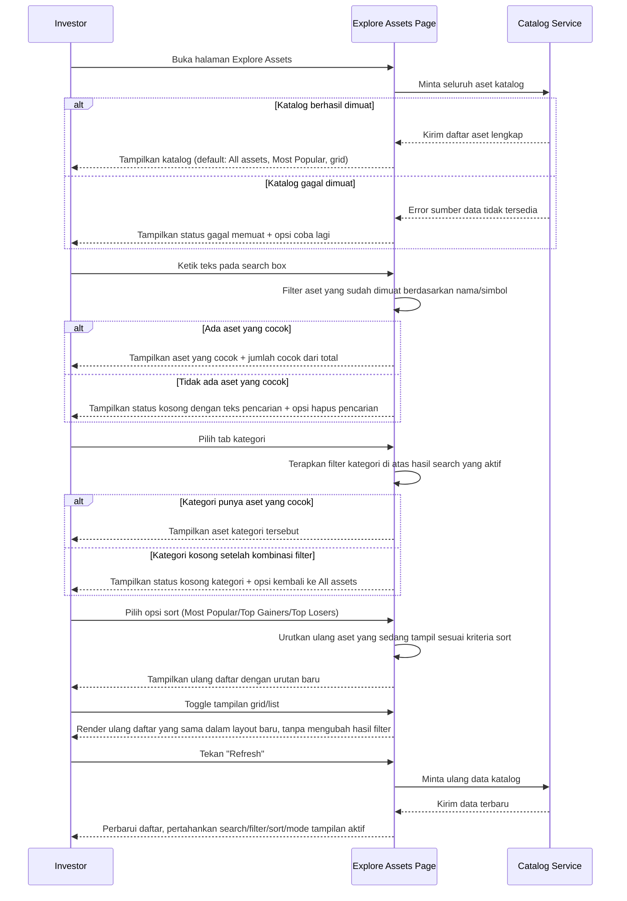

# Spec: Explore Assets Catalog — Search, Filter, Sort & View Toggle

## LAYER 1 — Functional Specification

### Overview

Investor yang membuka halaman Explore Assets saat ini harus menyisir seluruh katalog aset lintas kategori (RWA, Bonds, Stock, Utility Token, Stablecoin, dst) tanpa alat bantu untuk menyaring atau mengurutkan. Spec ini mendefinisikan pengalaman katalog: search realtime berdasarkan nama/simbol, filter kategori single-select, sort (Most Popular/Top Gainers/Top Losers), toggle tampilan grid/list, dan status "Upcoming"/"Sold out" pada aset yang relevan — semuanya bekerja bersamaan pada satu daftar aset yang selalu ditampilkan penuh tanpa pagination.

### User Stories

1. As an investor, I want to search assets by name or symbol as I type, so that I can quickly find a specific asset without scrolling through the full catalog.
2. As an investor, I want to filter the catalog to one category at a time, so that I can browse a specific type of asset (e.g. only Bonds or only RWA).
3. As an investor, I want to sort the catalog by popularity or by market movement, so that I can browse assets in the order that matters to me.
4. As an investor, I want to switch between grid and list view, so that I can browse in whichever layout suits how much detail I want to see at once.

### Functional Requirements

1. Sistem harus memfilter katalog secara realtime saat investor mengetik di search box, mencocokkan nama aset dan simbol/ticker.
2. Sistem harus menyediakan filter kategori yang bersifat single-select; memilih satu kategori menonaktifkan kategori yang sebelumnya aktif, dan "All assets" menghapus filter kategori.
3. Sistem harus menyediakan opsi pengurutan katalog: Most Popular (urutan default/kurasi tetap), Top Gainers, dan Top Losers.
4. Sistem harus menerapkan search, filter kategori, dan sort secara bersamaan pada daftar aset yang sama (kombinasi AND), bukan saling menggantikan.
5. Sistem harus menampilkan seluruh aset yang cocok dengan search/filter aktif dalam satu tampilan tanpa pagination, beserta indikator jumlah aset yang cocok dari total katalog.
6. Sistem harus mengizinkan investor beralih antara tampilan grid dan list tanpa mengubah hasil search/filter/sort yang sedang aktif.
7. Sistem harus menandai aset yang belum tradable dengan status "Upcoming" dan aset yang sudah habis terjual dengan status "Sold out" pada kedua tampilan grid maupun list.
8. Sistem harus menampilkan status kosong yang menjelaskan alasan (tidak ada hasil untuk pencarian tertentu, atau kategori tersebut belum punya aset) ketika kombinasi search/filter tidak menghasilkan aset apapun.

### Acceptance Criteria

**Happy Path**
- [ ] GIVEN investor mengetik sebagian nama atau simbol aset pada search box, WHEN hasil difilter, THEN sistem menampilkan hanya aset yang nama atau simbolnya cocok dengan teks tersebut secara realtime tanpa perlu submit.
- [ ] GIVEN investor menekan salah satu tab kategori (misal "Bonds"), WHEN filter diterapkan, THEN sistem menampilkan hanya aset dari kategori tersebut dan menonaktifkan kategori yang sebelumnya aktif.
- [ ] GIVEN investor sedang berada pada kategori tertentu, WHEN investor menekan "All assets", THEN sistem menghapus filter kategori dan menampilkan seluruh aset yang masih cocok dengan search yang aktif (jika ada).
- [ ] GIVEN investor memilih "Top Gainers" pada dropdown sort, WHEN katalog ditampilkan, THEN sistem mengurutkan aset yang sedang tampil dari persentase kenaikan harga 24 jam tertinggi ke terendah.
- [ ] GIVEN investor sedang memfilter kategori dan mengetik pada search box secara bersamaan, WHEN kedua kondisi aktif, THEN sistem menampilkan hanya aset yang memenuhi kategori tersebut dan cocok dengan teks pencarian.
- [ ] GIVEN investor sedang melihat hasil filter tertentu dalam tampilan grid, WHEN investor menekan toggle tampilan list, THEN sistem menampilkan aset yang sama dalam layout list tanpa mengubah hasil filter/search/sort yang aktif.

**Error Cases**
- [ ] GIVEN katalog aset gagal dimuat dari sumber data, WHEN investor membuka halaman Explore Assets, THEN sistem menampilkan status gagal memuat beserta opsi untuk mencoba lagi, bukan daftar kosong tanpa penjelasan.

**Edge Cases**
- [ ] GIVEN teks pencarian investor tidak cocok dengan nama maupun simbol aset manapun, WHEN hasil difilter, THEN sistem menampilkan status kosong yang menyebutkan teks pencarian tersebut, beserta opsi untuk menghapus pencarian.
- [ ] GIVEN sebuah kategori aktif tidak memiliki aset yang cocok (misal karena search yang aktif menyaring semuanya), WHEN kategori tersebut ditampilkan, THEN sistem menampilkan status kosong yang menyebutkan kategori tersebut, beserta opsi untuk kembali ke "All assets".
- [ ] GIVEN sebuah aset berstatus belum tradable, WHEN aset tersebut muncul di hasil manapun, THEN sistem menampilkan badge "Upcoming" pada aset tersebut dan tidak menampilkan harga aktif atau perubahan persentase.
- [ ] GIVEN sebuah aset yang tradable sudah habis terjual, WHEN aset tersebut muncul di hasil manapun, THEN sistem menampilkan badge "Sold out" tanpa menyembunyikan aset tersebut dari daftar.

**Infra/Config**
- [ ] GIVEN investor menekan tombol "Refresh" pada halaman Explore Assets, WHEN data dimuat ulang, THEN sistem memperbarui seluruh daftar aset sambil tetap mempertahankan search, filter kategori, sort, dan mode tampilan yang sedang aktif.

### Out of Scope

- Pagination atau infinite scroll ketika jumlah aset dalam katalog bertambah signifikan — follow-up spec terpisah bila diperlukan.
- Metrik popularitas otomatis untuk sort "Most Popular" (saat ini bersifat urutan kurasi tetap) — follow-up bila dibutuhkan.
- Filter kategori multi-select (memilih lebih dari satu kategori sekaligus) — follow-up bila dibutuhkan.
- Definisi ranking Top Gainers/Top Losers itu sendiri (sumber data, timeframe, eligibilitas aset) — sudah didefinisikan oleh spec Market Discovery Rails, direferensikan bukan diulang di sini.
- Search berdasarkan field selain nama dan simbol (misal issuer, deskripsi) — follow-up bila dibutuhkan.
- Penyimpanan preferensi tampilan grid/list antar sesi — follow-up bila dibutuhkan.

---

## LAYER 2 — Technical Design

### Flow Diagram

### Data Model Changes

No schema changes — fitur ini menggunakan atribut Asset yang sama dengan spec Market Discovery Rails (`category`, `tradable`, `soldOut`, `priceChangePct24h`, `name`, `symbol`); tidak ada entitas atau field baru yang diperlukan.

### Error Handling

| Scenario | HTTP Status | Error Code | Retry-safe? |
|---|---|---|---|
| Katalog aset gagal dimuat dari sumber data | 503 | `CATALOG_UNAVAILABLE` | Yes |
| Permintaan refresh katalog melebihi batas waktu | 504 | `CATALOG_REFRESH_TIMEOUT` | Yes |
| Parameter sort atau kategori yang diminta tidak dikenal | 400 | `INVALID_QUERY_PARAM` | Yes |
