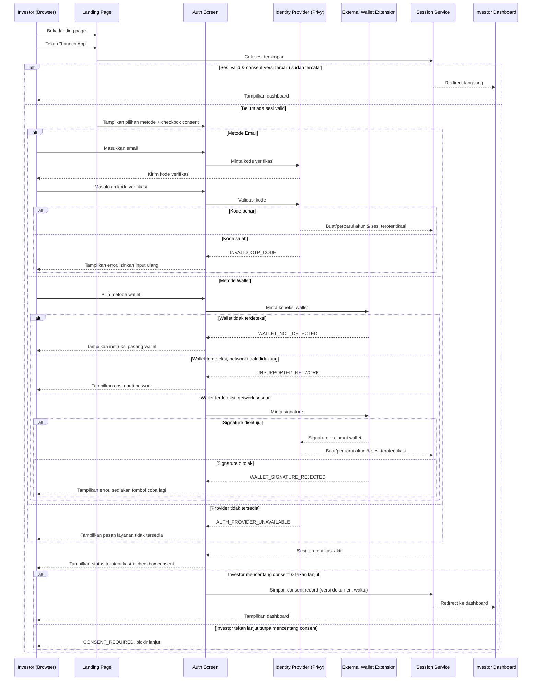

# Spec: Investor Access — Landing Page to Dashboard via Privy Authentication

## LAYER 1 — Functional Specification

### Overview

Calon investor saat ini mendarat di landing page Frakta tanpa jalur otentikasi nyata ke portal investor — implementasi yang ada hari ini adalah simulator mock (dropdown "sign-in simulation") yang meniru koneksi wallet, bukan integrasi Privy.io yang sesungguhnya. Spec ini mendefinisikan perilaku target: investor menekan "Launch App" dari landing page, login atau register dengan email maupun wallet melalui provider otentikasi pihak ketiga (Privy.io), menyetujui Terms of Service & Privacy Policy, lalu masuk ke halaman dashboard investor. Login dan register diperlakukan sebagai satu alur yang sama — tidak ada formulir registrasi terpisah.

### User Stories

1. As a prospective investor, I want to launch the app from the landing page and authenticate with either my email or my crypto wallet, so that I can reach the investor dashboard without filling out a separate registration form.
2. As a platform yang beroperasi di produk finansial teregulasi, I want setiap user mencatatkan persetujuan eksplisit atas Terms of Service dan Privacy Policy sebelum masuk dashboard, so that ada bukti kepatuhan yang bisa diaudit.
3. As a returning investor dengan sesi yang masih valid, I want langsung diarahkan ke dashboard saat menekan "Launch App", so that saya tidak perlu login ulang setiap kali kembali ke situs.

### Functional Requirements

1. Landing page harus menyediakan aksi "Launch App" yang memulai alur otentikasi.
2. Sistem harus menyediakan dua metode otentikasi yang setara kedudukannya — email (dengan kode verifikasi) dan wallet eksternal (berbasis signature) — melalui satu provider otentikasi pihak ketiga.
3. Sistem harus memperlakukan email atau alamat wallet yang belum pernah digunakan sebagai pembuatan akun baru secara otomatis, tanpa langkah registrasi terpisah dari langkah login.
4. Sistem harus menahan akses ke dashboard sampai user secara eksplisit menyetujui Terms of Service dan Privacy Policy melalui sebuah checkbox persetujuan.
5. Sistem harus mencatat setiap persetujuan term (identitas user, waktu persetujuan, versi dokumen yang disetujui), dan meminta persetujuan ulang bila versi dokumen berubah setelah persetujuan terakhir.
6. Sistem harus mengarahkan setiap user yang berhasil otentikasi dan telah menyetujui term ke halaman dashboard yang sama, terlepas dari status verifikasi identitas (KYC) akun tersebut.
7. Sistem harus menampilkan pesan kegagalan yang spesifik untuk setiap jenis kegagalan otentikasi (kode verifikasi salah, signature wallet ditolak, network wallet tidak didukung, wallet tidak terdeteksi), masing-masing dengan opsi untuk mencoba lagi.
8. Sistem harus mempertahankan sesi user yang valid melewati reload/navigasi, sehingga user yang sudah terotentikasi tidak diminta login ulang saat kembali membuka landing page atau me-refresh dashboard.

### Acceptance Criteria

**Happy Path**
- [ ] GIVEN investor berada di landing page dan belum memiliki sesi, WHEN investor menekan "Launch App", THEN sistem menampilkan halaman otentikasi dengan pilihan metode email atau wallet beserta checkbox persetujuan term.
- [ ] GIVEN investor memilih metode email dan memasukkan alamat email valid, WHEN investor menerima dan memasukkan kode verifikasi yang benar, THEN sistem mengotentikasi investor dan membuka sesi terotentikasi.
- [ ] GIVEN investor memilih metode wallet, wallet extension terpasang, dan wallet berada di network yang didukung, WHEN investor menyetujui permintaan signature di wallet, THEN sistem mengotentikasi investor dengan alamat wallet tersebut.
- [ ] GIVEN investor sudah terotentikasi namun belum menyetujui term, WHEN investor mencentang checkbox persetujuan Terms of Service & Privacy Policy dan menekan tombol lanjut, THEN sistem mencatat persetujuan tersebut dan mengarahkan investor ke halaman dashboard.
- [ ] GIVEN investor memiliki sesi yang masih valid dari kunjungan sebelumnya, WHEN investor menekan "Launch App" pada kunjungan berikutnya, THEN sistem langsung mengarahkan investor ke dashboard tanpa meminta otentikasi ulang.

**Error Cases**
- [ ] GIVEN investor memasukkan kode verifikasi email yang salah, WHEN kode disubmit, THEN sistem menampilkan pesan bahwa kode tidak valid dan mengizinkan investor mencoba memasukkan kode lain tanpa mengulang alur dari awal.
- [ ] GIVEN investor menolak (reject) permintaan signature di wallet, WHEN proses otentikasi wallet dibatalkan, THEN sistem menampilkan pesan bahwa signature ditolak dan menyediakan opsi untuk mencoba lagi.
- [ ] GIVEN wallet investor terhubung ke network yang tidak didukung platform, WHEN investor mencoba otentikasi wallet, THEN sistem menampilkan pesan network tidak sesuai beserta opsi untuk berpindah ke network yang didukung sebelum melanjutkan.
- [ ] GIVEN investor menekan tombol lanjut tanpa mencentang checkbox persetujuan term, WHEN tombol ditekan, THEN sistem mencegah investor masuk ke dashboard dan menampilkan indikasi bahwa persetujuan wajib dicentang terlebih dahulu.

**Edge Cases**
- [ ] GIVEN email atau alamat wallet yang digunakan investor belum pernah terdaftar sebelumnya, WHEN proses otentikasi berhasil, THEN sistem membuat akun baru secara otomatis dan melanjutkan investor ke langkah persetujuan term tanpa formulir registrasi tambahan.
- [ ] GIVEN dokumen Terms of Service/Privacy Policy diperbarui ke versi baru setelah investor menyetujui versi sebelumnya, WHEN investor dengan sesi valid mengakses kembali alur ini, THEN sistem meminta investor menyetujui ulang versi dokumen yang baru sebelum melanjutkan ke dashboard.

**Infra/Config**
- [ ] GIVEN provider otentikasi pihak ketiga sedang tidak dapat diakses atau timeout, WHEN investor mencoba login dengan metode apapun, THEN sistem menampilkan pesan bahwa layanan otentikasi sementara tidak tersedia dan menyarankan mencoba lagi nanti, tanpa membuka sesi parsial.

### Out of Scope

- Alur verifikasi identitas (KYC/KYB) dan efeknya pada konten dashboard (banner status, pembatasan transaksi) — ditangani oleh spec terpisah untuk KYC gating.
- Onboarding akun institusional/entitas (KYB) sebagai jalur berbeda dari investor personal — follow-up spec tersendiri.
- Mekanisme refresh/rotasi token sesi di level infrastruktur — detail teknis internal, bukan perilaku yang terlihat user pada spec ini.
- Metode otentikasi tambahan di luar yang disediakan provider pihak ketiga saat ini (misal passkey, hardware security key) — dipertimbangkan sebagai follow-up bila dibutuhkan.
- Lokalisasi/penerjemahan salinan teks pada halaman landing dan halaman otentikasi — follow-up terpisah.

---

## LAYER 2 — Technical Design

### Flow Diagram

### Data Model Changes

- **Account**: entitas baru/diperluas untuk merepresentasikan identitas investor.
  - `id` (identifier unik)
  - `primaryAuthMethod` (`email` | `wallet`)
  - `email` (nullable, terisi bila pernah login via email)
  - `walletAddress` (nullable, terisi bila pernah login via wallet)
  - `createdAt`
  - `lastLoginAt`
- **ConsentRecord**: entitas baru untuk mencatat persetujuan Terms of Service & Privacy Policy.
  - `id`
  - `accountId` (relasi ke Account)
  - `documentVersion` (versi dokumen Terms/Privacy yang disetujui)
  - `agreedAt` (timestamp persetujuan)
  - Constraint: akses ke dashboard mensyaratkan adanya `ConsentRecord` milik `accountId` tersebut dengan `documentVersion` yang cocok dengan versi dokumen yang sedang berlaku.

### Integration Mapping

| Sistem Eksternal | Arah Data | Data yang Dipertukarkan | Trigger |
|---|---|---|---|
| Identity Provider (Privy — email OTP & wallet auth) | Dua arah | Alamat email / kode verifikasi; alamat wallet / signature challenge & response; token sesi terotentikasi | Investor memilih metode email atau wallet pada Auth Screen |
| External Wallet Extension (browser) | Dua arah | Alamat wallet, network id yang terhubung, signature pesan otentikasi | Investor memilih metode wallet dan menyetujui/menolak permintaan koneksi atau signature |

### Error Handling

| Scenario | HTTP Status | Error Code | Retry-safe? |
|---|---|---|---|
| Kode verifikasi email salah | 400 | `INVALID_OTP_CODE` | Yes |
| Signature wallet ditolak investor | 400 | `WALLET_SIGNATURE_REJECTED` | Yes |
| Wallet terhubung ke network yang tidak didukung | 400 | `UNSUPPORTED_NETWORK` | Yes |
| Wallet extension tidak terdeteksi di browser | 400 | `WALLET_NOT_DETECTED` | Yes |
| Tombol lanjut ditekan tanpa checkbox consent tercentang | 422 | `CONSENT_REQUIRED` | Yes |
| Versi dokumen term berubah, consent lama tidak lagi valid | 409 | `CONSENT_VERSION_OUTDATED` | Yes |
| Provider otentikasi pihak ketiga tidak tersedia/timeout | 503 | `AUTH_PROVIDER_UNAVAILABLE` | Yes |
| Sesi kedaluwarsa saat mengakses dashboard | 401 | `SESSION_EXPIRED` | Yes |
