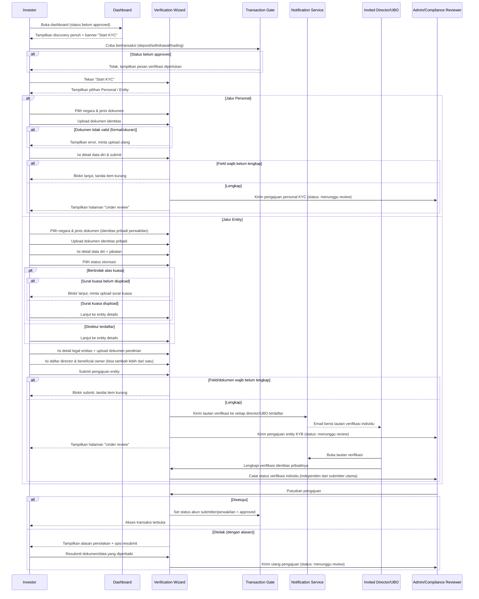

# Spec: Investor KYC (Personal) & KYB (Entity) Verification

## LAYER 1 — Functional Specification

### Overview

Investor yang sudah masuk ke dashboard saat ini belum punya jalur verifikasi identitas yang mengatur kapan mereka boleh bertransaksi. Spec ini mendefinisikan perilaku target: investor yang belum menyelesaikan KYC/KYB tetap bisa melakukan discovery (menjelajah aset) tanpa batasan, tetapi tidak bisa melakukan transaksi apapun — termasuk deposit dan withdrawal — sampai pengajuan verifikasinya disetujui admin. Dari dashboard, investor menekan "Start KYC" dan memilih salah satu dari dua jalur: **Personal** (individu) atau **Entity/Institutional** (KYB, atas nama perusahaan). Jalur Entity mencakup verifikasi identitas perwakilan yang mengajukan, pembuktian otorisasi (direktur langsung atau kuasa), detail legal entitas, serta pendaftaran direktur & pemilik manfaat (beneficial owner) — masing-masing menerima tautan verifikasi terpisah untuk menyelesaikan identitasnya sendiri. Setelah submit, investor menunggu keputusan admin; bila ditolak, investor bisa resubmit.

### User Stories

1. As an unverified investor, I want to keep exploring tokenized assets on the dashboard while my verification is incomplete or pending, so that I don't lose access to discovery just because I haven't finished compliance requirements.
2. As an individual investor, I want to submit a personal KYC application with my identity document and personal details, so that my account gets approved for trading, deposit, and withdrawal.
3. As a company representative, I want to submit a KYB application on behalf of my entity — proving my authorization, the entity's legal details, and its directors & beneficial owners — so that our entity's account gets approved for transactions.
4. As an invited director or beneficial owner, I want to receive and complete my own verification link, so that my identity is confirmed independently without sharing credentials with the main submitter.

### Functional Requirements

1. Sistem harus mengizinkan investor yang belum menyelesaikan KYC/KYB untuk tetap melakukan discovery (menjelajah aset) tanpa batasan apapun.
2. Sistem harus menahan semua jenis transaksi — termasuk deposit, withdrawal, dan aktivitas trading lain — untuk akun yang status verifikasinya belum approved.
3. Sistem harus menyediakan dua jalur verifikasi yang dipilih investor di awal: Personal (individu) dan Entity (korporat/institusional).
4. Untuk jalur Personal, sistem harus mengumpulkan negara penerbit dan jenis dokumen identitas, dokumen identitas itu sendiri, serta data diri sesuai dokumen, sebelum pengajuan dapat disubmit untuk review admin.
5. Untuk jalur Entity, sistem harus mengumpulkan identitas personal perwakilan yang mengajukan, status otorisasinya (direktur terdaftar atau bertindak atas kuasa), dokumen surat kuasa bila bukan direktur, detail legal entitas beserta dokumen pendiriannya, dan daftar direktur & pemilik manfaat, sebelum pengajuan dapat disubmit untuk review admin.
6. Sistem harus mewajibkan surat kuasa yang ditandatangani ketika perwakilan menyatakan dirinya bertindak atas kuasa (bukan direktur terdaftar), dan mencegah investor melanjutkan ke step berikutnya tanpa dokumen tersebut.
7. Sistem harus mengirimkan tautan verifikasi terpisah ke setiap direktur/pemilik manfaat tambahan yang didaftarkan pada pengajuan entity, agar masing-masing dapat menyelesaikan verifikasi identitasnya sendiri secara independen dari submitter utama.
8. Sistem harus menampilkan status pengajuan kepada investor (menunggu review, disetujui, atau ditolak beserta alasan) dan mengizinkan resubmission ketika pengajuan ditolak.

### Acceptance Criteria

**Happy Path**
- [ ] GIVEN investor belum menyelesaikan KYC/KYB, WHEN investor membuka halaman discovery aset di dashboard, THEN sistem menampilkan seluruh konten discovery tanpa pembatasan apapun.
- [ ] GIVEN investor menekan "Start KYC" dan memilih jalur Personal, WHEN investor memilih negara & jenis dokumen, mengupload dokumen identitas, mengisi detail data diri sesuai dokumen, lalu submit, THEN sistem membuat pengajuan personal KYC berstatus menunggu review dan menampilkan halaman status pending kepada investor.
- [ ] GIVEN investor memilih jalur Entity dan menyatakan dirinya direktur terdaftar, WHEN investor melengkapi identitas pribadinya, detail legal entitas beserta dokumen pendirian, dan daftar direktur & pemilik manfaat, lalu submit, THEN sistem membuat pengajuan entity KYB berstatus menunggu review.
- [ ] GIVEN investor memilih jalur Entity dan menyatakan dirinya bertindak atas kuasa, WHEN investor mengupload surat kuasa yang ditandatangani beserta seluruh detail lain yang disyaratkan, lalu submit, THEN sistem membuat pengajuan entity KYB berstatus menunggu review yang menyertakan dokumen kuasa tersebut.
- [ ] GIVEN seorang direktur/pemilik manfaat telah didaftarkan pada pengajuan entity dan menerima tautan verifikasi via email, WHEN orang tersebut membuka tautan dan menyelesaikan verifikasi identitasnya sendiri, THEN sistem mencatat status verifikasi individu tersebut secara independen dari data yang diinput submitter utama.

**Error Cases**
- [ ] GIVEN akun investor belum berstatus approved (belum mengajukan atau masih menunggu review), WHEN investor mencoba melakukan transaksi apapun termasuk deposit atau withdrawal, THEN sistem menolak transaksi tersebut dan menampilkan pesan bahwa verifikasi identitas harus diselesaikan lebih dulu.
- [ ] GIVEN investor sedang mengisi salah satu step wizard KYC/KYB yang mensyaratkan dokumen atau field wajib, WHEN investor menekan tombol lanjut tanpa melengkapi item wajib tersebut, THEN sistem mencegah investor lanjut ke step berikutnya dan menandai item mana yang masih kurang.
- [ ] GIVEN investor pada jalur Entity menyatakan bertindak atas kuasa, WHEN investor mencoba lanjut tanpa mengupload surat kuasa, THEN sistem memblokir kelanjutan proses dan menampilkan pesan bahwa dokumen kuasa wajib diunggah.

**Edge Cases**
- [ ] GIVEN admin menolak pengajuan KYC atau KYB dengan alasan tertentu, WHEN investor membuka kembali halaman status pengajuannya, THEN sistem menampilkan alasan penolakan dan menyediakan jalur resubmission tanpa mengulang seluruh data yang masih valid.
- [ ] GIVEN admin menyetujui pengajuan KYC personal atau KYB entity, WHEN persetujuan tersebut disimpan, THEN akun submitter/perwakilan yang mengajukan langsung mendapatkan akses untuk melakukan transaksi (termasuk deposit dan withdrawal) tanpa langkah tambahan.

**Infra/Config**
- [ ] GIVEN investor mengupload berkas dokumen identitas atau dokumen pendukung lain, WHEN berkas tersebut gagal diproses karena ukuran atau format tidak didukung, THEN sistem menampilkan pesan error yang menjelaskan batasan format/ukuran dan mengizinkan investor mengunggah ulang tanpa kehilangan data lain yang sudah diisi pada step tersebut.

### Out of Scope

- Implementasi tampilan/workflow internal reviewer (Admin Compliance Console) untuk memproses keputusan approve/reject — follow-up spec terpisah.
- Validasi ketat kelengkapan persentase ownership UBO (misal wajib total 100%) — saat ini bersifat informasional saja; validasi otomatis menjadi follow-up bila dibutuhkan.
- Renewal/expiry periodik atas verifikasi yang sudah approved (re-KYC/KYB setelah periode tertentu) — follow-up spec terpisah.
- Aturan penentuan siapa saja director/UBO yang wajib didaftarkan berdasarkan threshold ownership spesifik per jurisdiksi — follow-up spec kepatuhan regional.
- Metode pengiriman tautan verifikasi selain email (misal SMS/WhatsApp) untuk director/UBO — follow-up bila dibutuhkan.

---

## LAYER 2 — Technical Design

### Flow Diagram

### Data Model Changes

- **VerificationSubmission**: entitas baru yang merepresentasikan satu pengajuan KYC/KYB.
  - `id`
  - `accountId` (submitter/perwakilan yang mengajukan)
  - `type` (`personal` | `entity`)
  - `status` (`pending` | `approved` | `rejected`)
  - `country`, `documentType`, `identityDocumentFile`
  - `personalDetails` (nama, nomor dokumen, dan untuk entity: jabatan)
  - `submittedAt`, `decidedAt`, `decidedBy`, `rejectionReason` (nullable)
- **EntityProfile**: entitas tambahan, hanya terisi ketika `VerificationSubmission.type = entity`.
  - `id`
  - `submissionId` (relasi ke VerificationSubmission)
  - `representativeIsDirector` (boolean)
  - `authorizationLetterFile` (nullable, wajib terisi ketika `representativeIsDirector = false`)
  - `legalEntityName`, `registrationNumber`, `jurisdiction`, `registeredAddress`, `certificateOfIncorporationFile`
- **BeneficialOwner**: entitas baru, satu atau lebih per EntityProfile.
  - `id`
  - `entityProfileId` (relasi ke EntityProfile)
  - `fullName`, `role`, `ownershipPercent`, `email`
  - `verificationStatus` (`invited` | `verified` | `expired`)
  - `verificationToken`, `verifiedAt` (nullable)
- Constraint: akses ke aksi transaksi (deposit, withdrawal, trading) mensyaratkan `accountId` submitter/perwakilan memiliki `VerificationSubmission` dengan `status = approved`.

### Permission Model

| Role | Aksi yang Diizinkan | Aksi yang Ditolak |
|---|---|---|
| Investor (submitter Personal/Entity) | Mengisi & submit pengajuan miliknya sendiri; melihat status pengajuan; melakukan discovery kapan saja terlepas status verifikasi; melakukan resubmission setelah ditolak | Bertransaksi (deposit/withdrawal/trading) sebelum status approved; menyetujui/menolak pengajuan miliknya sendiri; melihat atau mengubah pengajuan entity milik akun lain |
| Invited Director/Beneficial Owner | Membuka tautan verifikasi miliknya sendiri dan menyelesaikan verifikasi identitas pribadinya | Mengubah data entity submission utama; menyetujui/menolak pengajuan; bertransaksi atas nama entity |
| Admin/Compliance Reviewer | Melihat seluruh pengajuan KYC/KYB yang masuk; menyetujui atau menolak pengajuan beserta alasan | Mengisi/mengubah data pengajuan milik investor; bertransaksi atas nama investor manapun |

### Integration Mapping

| Sistem Eksternal | Arah Data | Data yang Dipertukarkan | Trigger |
|---|---|---|---|
| Notification/Email Service | Keluar | Alamat email director/UBO, tautan verifikasi unik, nama entitas terkait | Pengajuan entity KYB berhasil disubmit dengan satu atau lebih director/UBO terdaftar |

### Error Handling

| Scenario | HTTP Status | Error Code | Retry-safe? |
|---|---|---|---|
| Transaksi dicoba saat status verifikasi belum approved | 403 | `VERIFICATION_REQUIRED` | Yes |
| Lanjut ke step berikutnya tanpa dokumen/field wajib terisi | 422 | `REQUIRED_FIELD_MISSING` | Yes |
| Bertindak atas kuasa tanpa upload surat kuasa | 422 | `AUTHORIZATION_LETTER_MISSING` | Yes |
| Upload dokumen gagal karena format/ukuran tidak didukung | 400 | `INVALID_DOCUMENT_FORMAT` | Yes |
| Tautan verifikasi director/UBO sudah kadaluwarsa atau sudah dipakai | 410 | `VERIFICATION_LINK_EXPIRED` | No — perlu tautan baru dikirim ulang |
| Submission entity diajukan dengan detail legal entitas tidak lengkap | 422 | `ENTITY_DETAILS_INCOMPLETE` | Yes |
| Resubmission dilakukan tanpa memperbaiki item yang disebutkan dalam alasan penolakan | 422 | `RESUBMISSION_INCOMPLETE` | Yes |
