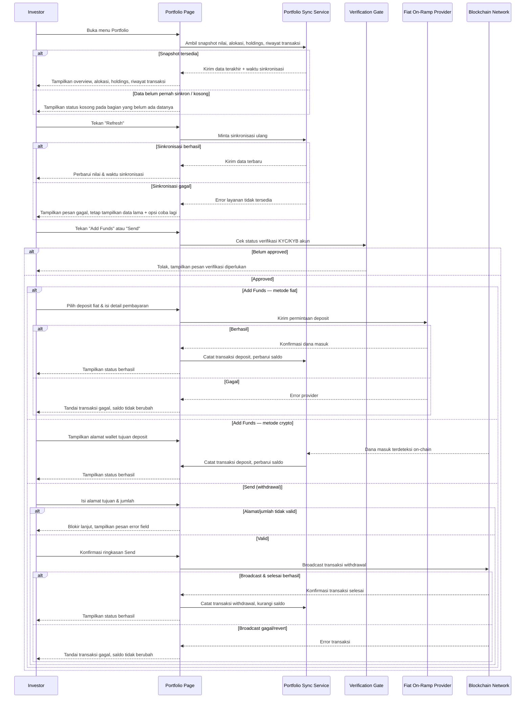

# Spec: Investor Portfolio — Overview, Holdings, Deposit & Withdrawal

## LAYER 1 — Functional Specification

### Overview

Investor yang sudah masuk ke platform butuh satu tempat untuk melihat performa investasinya dan memindahkan dana masuk/keluar akun. Spec ini mendefinisikan menu Portfolio: ringkasan nilai total portfolio (dari snapshot data yang disinkronkan periodik dari data on-chain), breakdown alokasi per kategori/aset, daftar holdings, riwayat transaksi, serta dua aksi utama — **Add Funds** (deposit via fiat on-ramp atau crypto) dan **Send** (withdrawal ke alamat eksternal). Kedua aksi tersebut hanya bisa dilakukan oleh akun yang status KYC/KYB-nya sudah approved.

### User Stories

1. As an investor, I want to see my total portfolio value and how it's changed over time, so that I can track my investment performance at a glance.
2. As an investor, I want to see a breakdown of my holdings by asset and category along with my transaction history, so that I understand what I own and what has happened to my account.
3. As a verified investor, I want to deposit funds into my account via fiat or crypto, so that I can start investing.
4. As a verified investor, I want to send/withdraw funds to an external address, so that I can move my assets out of the platform when needed.

### Functional Requirements

1. Sistem harus menampilkan total nilai portfolio investor (dihitung dari snapshot data saldo & harga yang disinkronkan secara periodik) beserta perubahan nilainya sepanjang waktu kepemilikan (all-time).
2. Sistem harus menampilkan waktu sinkronisasi terakhir dan menyediakan aksi refresh manual yang memicu sinkronisasi ulang data saldo dan harga.
3. Sistem harus menampilkan breakdown alokasi portfolio investor per kategori/aset secara proporsional terhadap nilainya.
4. Sistem harus menampilkan daftar holdings investor (aset, jumlah, nilai saat ini, perubahan nilai) dan riwayat transaksi (jenis, jumlah, status, waktu) miliknya sendiri.
5. Sistem harus menahan aksi Add Funds dan Send untuk akun yang status verifikasi KYC/KYB-nya belum approved.
6. Untuk aksi Add Funds, sistem harus menyediakan metode deposit fiat (on-ramp) dan deposit crypto (alamat wallet tujuan), dan mencatat dana yang masuk sebagai transaksi baru begitu terkonfirmasi.
7. Untuk aksi Send, sistem harus mengumpulkan alamat/tujuan penerima dan jumlah, menampilkan ringkasan konfirmasi sebelum broadcast, dan mencatat hasilnya sebagai transaksi baru.
8. Sistem harus menampilkan status pemrosesan yang jelas (pending/berhasil/gagal) untuk setiap transaksi deposit maupun withdrawal yang sedang berjalan.

### Acceptance Criteria

**Happy Path**
- [ ] GIVEN investor membuka menu Portfolio, WHEN halaman dimuat, THEN sistem menampilkan total nilai portfolio beserta perubahan nilai all-time dan waktu sinkronisasi terakhir.
- [ ] GIVEN investor menekan tombol Refresh, WHEN sinkronisasi selesai, THEN sistem memperbarui total nilai portfolio dan waktu sinkronisasi terakhir tanpa memuat ulang halaman.
- [ ] GIVEN investor memiliki holdings di lebih dari satu kategori aset, WHEN investor melihat bagian alokasi, THEN sistem menampilkan proporsi nilai tiap kategori/aset terhadap total portfolio.
- [ ] GIVEN investor memiliki riwayat transaksi, WHEN investor melihat bagian riwayat transaksi, THEN sistem menampilkan setiap transaksi beserta jenis, jumlah, status, dan waktunya, hanya milik akun investor tersebut.
- [ ] GIVEN akun investor berstatus approved dan investor memilih metode deposit fiat atau crypto lalu menyelesaikan langkah yang disyaratkan, WHEN dana terkonfirmasi masuk, THEN sistem mencatat transaksi deposit baru dan memperbarui total nilai portfolio.
- [ ] GIVEN akun investor berstatus approved dan investor mengisi alamat tujuan serta jumlah yang valid lalu mengonfirmasi Send, WHEN transaksi berhasil di-broadcast dan selesai, THEN sistem mencatat transaksi withdrawal baru dan mengurangi saldo yang tersedia.

**Error Cases**
- [ ] GIVEN akun investor belum berstatus approved, WHEN investor menekan Add Funds atau Send, THEN sistem mencegah aksi tersebut dan menampilkan pesan bahwa verifikasi identitas harus diselesaikan lebih dulu.
- [ ] GIVEN investor mengisi alamat tujuan Send yang tidak valid atau jumlah yang melebihi saldo yang tersedia, WHEN investor mencoba melanjutkan ke konfirmasi, THEN sistem memblokir kelanjutan dan menampilkan pesan kesalahan spesifik untuk field yang bermasalah.
- [ ] GIVEN transaksi deposit atau withdrawal gagal diproses (misal ditolak provider atau revert on-chain), WHEN kegagalan terdeteksi, THEN sistem menandai transaksi tersebut sebagai gagal beserta alasannya, dan tidak mengubah saldo portfolio seolah transaksi berhasil.

**Edge Cases**
- [ ] GIVEN investor belum memiliki holdings maupun riwayat transaksi apapun, WHEN investor membuka menu Portfolio, THEN sistem menampilkan status kosong yang menjelaskan belum ada aktivitas, bukan tabel/grafik kosong tanpa penjelasan.
- [ ] GIVEN data sinkronisasi portfolio sudah melewati interval yang diharapkan tanpa berhasil diperbarui, WHEN investor membuka menu Portfolio, THEN sistem tetap menampilkan nilai terakhir yang diketahui beserta indikasi bahwa data tersebut belum sinkron terbaru, bukan menyembunyikan seluruh halaman.

**Infra/Config**
- [ ] GIVEN layanan sinkronisasi data portfolio tidak dapat diakses saat investor menekan Refresh, WHEN permintaan refresh gagal, THEN sistem menampilkan pesan gagal sinkronisasi, tetap menampilkan data terakhir yang tersimpan, dan menyediakan opsi untuk mencoba lagi.

### Out of Scope

- Definisi lengkap metode pembayaran fiat on-ramp yang didukung (kartu, bank transfer, dst) — follow-up spec integrasi payment provider.
- Batas minimum/maksimum jumlah deposit dan withdrawal per transaksi — follow-up spec kebijakan bisnis.
- Pemilihan network blockchain tujuan untuk withdrawal multi-chain — follow-up bila dibutuhkan.
- Filter dan ekspor riwayat transaksi lanjutan (rentang tanggal, jenis, format ekspor) — follow-up bila dibutuhkan.
- Notifikasi (email/push) atas perubahan status deposit/withdrawal — follow-up bila dibutuhkan.

---

## LAYER 2 — Technical Design

### Flow Diagram

### Data Model Changes

- **PortfolioSnapshot**: entitas baru per akun, hasil sinkronisasi periodik.
  - `accountId`, `totalValue`, `changeAllTime`, `changeAllTimePct`, `lastSyncedAt`
- **Holding**: entitas baru, satu atau lebih per akun.
  - `accountId`, `assetId`, `quantity`, `currentValue`, `changePct`
- **Transaction**: entitas baru untuk riwayat, termasuk deposit dan withdrawal.
  - `id`, `accountId`, `type` (`deposit` | `withdrawal` | `trade` | `reward`), `method` (`fiat` | `crypto`, khusus deposit), `amount`, `asset`, `status` (`pending` | `success` | `failed`), `failureReason` (nullable), `destinationAddress` (khusus withdrawal), `createdAt`, `completedAt`
- Constraint: pembuatan `Transaction` bertipe `deposit` atau `withdrawal` mensyaratkan akun terkait memiliki `VerificationSubmission` (didefinisikan pada spec KYC/KYB) dengan `status = approved`.

### Integration Mapping

| Sistem Eksternal | Arah Data | Data yang Dipertukarkan | Trigger |
|---|---|---|---|
| Blockchain/On-chain Data Provider | Masuk | Saldo wallet, harga aset on-chain | Sinkronisasi periodik atau investor menekan Refresh |
| Fiat On-Ramp Provider | Dua arah | Detail pembayaran investor, status transaksi deposit | Investor memilih metode deposit fiat pada Add Funds |
| Blockchain Network | Keluar | Alamat tujuan, jumlah, transaksi withdrawal yang di-broadcast | Investor mengonfirmasi Send |

### Error Handling

| Scenario | HTTP Status | Error Code | Retry-safe? |
|---|---|---|---|
| Add Funds/Send dicoba sebelum status verifikasi approved | 403 | `VERIFICATION_REQUIRED` | Yes |
| Alamat tujuan Send tidak valid | 422 | `INVALID_RECIPIENT_ADDRESS` | Yes |
| Jumlah Send melebihi saldo yang tersedia | 422 | `INSUFFICIENT_BALANCE` | Yes |
| Sinkronisasi data portfolio gagal diambil | 503 | `PORTFOLIO_SYNC_UNAVAILABLE` | Yes |
| Transaksi deposit gagal diproses oleh provider | 502 | `DEPOSIT_PROVIDER_ERROR` | Yes |
| Transaksi withdrawal gagal di-broadcast atau revert on-chain | 502 | `WITHDRAWAL_BROADCAST_FAILED` | Yes |
