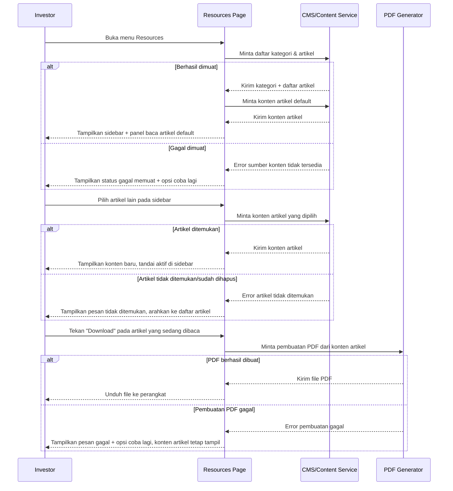

# Spec: Resources — Knowledge Base

## LAYER 1 — Functional Specification

### Overview

Investor sering butuh penjelasan mandiri tentang cara kerja platform (apa itu Frakta, cara mendanai akun, cara swap, cara kerja yield) tanpa harus menghubungi support. Spec ini mendefinisikan Knowledge Base pada menu Resources: daftar artikel yang dikelompokkan per kategori di sidebar, panel baca untuk konten artikel yang dipilih, dan tombol Download yang menghasilkan PDF dari artikel yang sedang dibaca. Konten dikelola melalui CMS/content service terpisah dari rilis aplikasi, dan seluruh artikel terbuka untuk investor manapun yang sudah login, terlepas dari status KYC/KYB mereka.

### User Stories

1. As an investor, I want to browse articles organized by category, so that I can find guidance relevant to what I'm trying to do (getting started, trading, yields).
2. As an investor, I want to read an article's full content in a dedicated pane, so that I can understand a topic without leaving the platform.
3. As an investor, I want to download an article as a PDF, so that I can save or share it for reference outside the platform.

### Functional Requirements

1. Sistem harus menampilkan daftar artikel yang dikelompokkan per kategori pada sidebar Knowledge Base.
2. Sistem harus menampilkan konten lengkap artikel yang dipilih investor pada panel baca, termasuk judul dan format teks terstruktur (heading, list, teks tebal).
3. Sistem harus mengizinkan investor manapun yang sudah login membaca seluruh artikel, terlepas dari status verifikasi KYC/KYB mereka.
4. Sistem harus mengambil daftar kategori, daftar artikel, dan konten artikel dari sumber konten yang dikelola terpisah dari rilis aplikasi (CMS/content service).
5. Sistem harus menghasilkan file PDF dari konten artikel yang sedang ditampilkan setiap kali investor menekan tombol Download.
6. Sistem harus menandai artikel yang sedang dibaca investor sebagai aktif/terpilih pada sidebar, agar investor tahu posisinya dalam daftar.
7. Sistem harus menampilkan status kosong yang menjelaskan alasan ketika sebuah kategori belum memiliki artikel, atau ketika seluruh Knowledge Base gagal dimuat.
8. Sistem harus tetap menampilkan konten artikel yang sedang dibaca meskipun proses pembuatan PDF sedang berjalan atau gagal, tanpa mengganggu pengalaman membaca.

### Acceptance Criteria

**Happy Path**
- [ ] GIVEN investor membuka menu Resources, WHEN halaman dimuat, THEN sistem menampilkan sidebar kategori beserta artikel di dalamnya dan menampilkan satu artikel default pada panel baca.
- [ ] GIVEN investor menekan salah satu judul artikel pada sidebar, WHEN artikel dipilih, THEN sistem menampilkan konten lengkap artikel tersebut pada panel baca dan menandainya sebagai aktif pada sidebar.
- [ ] GIVEN investor sedang membaca sebuah artikel, WHEN investor menekan tombol Download, THEN sistem menghasilkan file PDF dari konten artikel tersebut dan mengunduhkannya ke perangkat investor.
- [ ] GIVEN akun investor belum berstatus approved KYC/KYB, WHEN investor membuka dan membaca artikel apapun di Knowledge Base, THEN sistem mengizinkan akses penuh tanpa pembatasan apapun.

**Error Cases**
- [ ] GIVEN daftar artikel/kategori gagal diambil dari sumber konten, WHEN investor membuka menu Resources, THEN sistem menampilkan status gagal memuat beserta opsi untuk mencoba lagi, bukan sidebar kosong tanpa penjelasan.
- [ ] GIVEN proses pembuatan PDF gagal, WHEN investor menekan Download, THEN sistem menampilkan pesan gagal membuat file beserta opsi untuk mencoba lagi, tanpa mengubah tampilan konten artikel yang sedang dibaca.

**Edge Cases**
- [ ] GIVEN sebuah kategori pada Knowledge Base belum memiliki artikel apapun, WHEN investor melihat kategori tersebut, THEN sistem menampilkan status kosong yang menjelaskan belum ada artikel pada kategori itu.
- [ ] GIVEN artikel yang sedang dibaca investor dihapus atau tidak lagi tersedia di sumber konten setelah dimuat, WHEN investor mencoba mengaksesnya kembali, THEN sistem menampilkan pesan artikel tidak ditemukan dan mengarahkan investor kembali ke daftar artikel.
- [ ] GIVEN Knowledge Base belum memiliki artikel apapun sama sekali, WHEN investor membuka menu Resources, THEN sistem menampilkan status kosong pada seluruh halaman yang menjelaskan belum ada konten tersedia.

**Infra/Config**
- [ ] GIVEN sumber konten (CMS/content service) sedang tidak dapat diakses saat investor sudah berada di halaman Resources, WHEN investor mencoba membuka artikel lain, THEN sistem menampilkan status gagal memuat pada panel baca sambil tetap mempertahankan artikel yang sudah terbuka sebelumnya.

### Out of Scope

- Pencarian di dalam Knowledge Base (mencari artikel berdasarkan kata kunci) — follow-up bila dibutuhkan; search box global saat ini khusus untuk mencari aset.
- Jenis konten selain artikel teks (video, FAQ interaktif, forum) — follow-up bila dibutuhkan.
- Personalisasi urutan/rekomendasi artikel berdasarkan aktivitas investor — follow-up bila dibutuhkan.
- Versi/riwayat perubahan artikel dan proses editorial di sisi admin — didefinisikan oleh CMS/content service yang mendasarinya, bukan spec ini.
- Terjemahan/lokalisasi konten artikel ke bahasa selain default — follow-up terpisah.

---

## LAYER 2 — Technical Design

### Flow Diagram

### Data Model Changes

No schema changes pada sisi platform — `Article` dan `ArticleCategory` dikelola penuh di CMS/content service eksternal; platform hanya membaca dan menyimpannya secara transien (tidak dipersistensi ulang sebagai entitas platform sendiri).

### Integration Mapping

| Sistem Eksternal | Arah Data | Data yang Dipertukarkan | Trigger |
|---|---|---|---|
| CMS/Content Service | Masuk | Daftar kategori, daftar artikel, konten artikel, metadata untuk pembuatan PDF | Investor membuka menu Resources atau memilih artikel lain |

### Error Handling

| Scenario | HTTP Status | Error Code | Retry-safe? |
|---|---|---|---|
| Daftar artikel/kategori gagal diambil dari CMS | 503 | `CONTENT_SERVICE_UNAVAILABLE` | Yes |
| Artikel yang diminta tidak ditemukan | 404 | `ARTICLE_NOT_FOUND` | Yes |
| Pembuatan PDF dari artikel gagal | 500 | `PDF_GENERATION_FAILED` | Yes |
