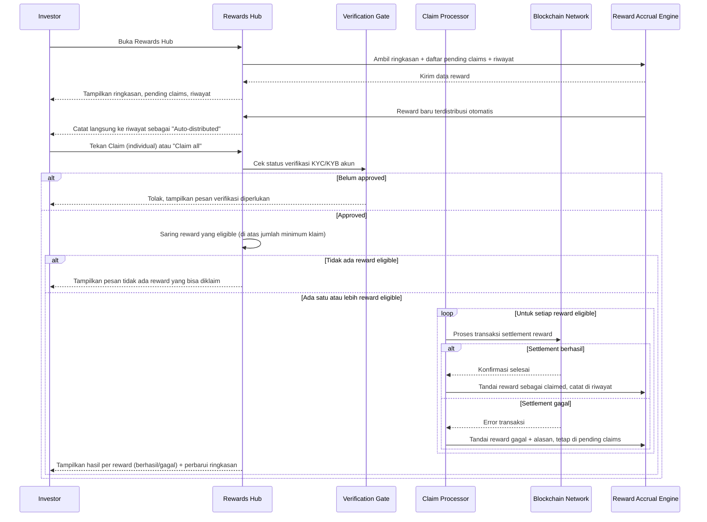

# Spec: Rewards Hub — Pending Claims & Reward History

## LAYER 1 — Functional Specification

### Overview

Investor yang memegang aset penghasil yield (dividend, rental yield, staking reward, coupon) butuh satu tempat untuk melihat berapa yang sudah diperoleh, berapa yang masih bisa diklaim, dan mengklaimnya ke wallet mereka. Spec ini mendefinisikan Rewards Hub: ringkasan total earned/pending/claimed, daftar pending claims dengan jumlah minimum klaim dan tenggat yang bersifat peringatan (bukan pembatas keras), aksi klaim individual maupun batch ("Claim all") yang digate oleh status KYC/KYB, serta riwayat reward lengkap dengan status dan alasan kegagalan.

### User Stories

1. As an investor, I want to see how much reward I've earned, how much is pending claim, and how much I've already claimed, so that I can track my yield at a glance.
2. As a verified investor, I want to claim one or all of my pending rewards, so that the funds settle to my wallet.
3. As an investor, I want to see my reward history including failed claims and why they failed, so that I understand what happened to my funds.

### Functional Requirements

1. Sistem harus menampilkan ringkasan total reward yang pernah diperoleh (lifetime), total yang masih pending untuk diklaim, dan total yang sudah diklaim/settled.
2. Sistem harus menampilkan daftar reward yang pending klaim beserta aset, jenis reward, jumlah, kapan menjadi tersedia, dan tenggat klaim yang direkomendasikan.
3. Sistem harus menerapkan jumlah minimum klaim; reward yang nilainya di bawah ambang tersebut ditandai tidak bisa diklaim beserta alasannya, tanpa menyembunyikan reward tersebut dari daftar.
4. Sistem harus mengizinkan investor mengklaim satu reward secara individual atau beberapa reward sekaligus melalui satu aksi ("Claim all"), dengan tiap reward diproses independen sehingga hasil bisa berupa sebagian berhasil dan sebagian gagal.
5. Sistem harus menahan aksi klaim (individual maupun Claim all) untuk akun yang status verifikasi KYC/KYB-nya belum approved.
6. Sistem harus mempertahankan reward yang telah melewati tenggat klaim yang direkomendasikan sebagai tetap claimable, hanya menampilkan indikasi peringatan pada tenggat tersebut.
7. Sistem harus mencatat setiap reward yang didistribusikan otomatis (tanpa aksi klaim manual investor) langsung ke riwayat dengan status tersendiri.
8. Sistem harus menampilkan riwayat reward (aset, jenis, jumlah, status, tanggal, tautan bukti transaksi) beserta alasan kegagalan untuk klaim yang gagal.

### Acceptance Criteria

**Happy Path**
- [ ] GIVEN investor memiliki reward yang sudah pernah diperoleh, pending, dan sudah diklaim, WHEN investor membuka Rewards Hub, THEN sistem menampilkan tiga ringkasan tersebut (total earned, pending claims, total claimed) yang konsisten satu sama lain.
- [ ] GIVEN akun investor berstatus approved dan terdapat satu reward pending yang memenuhi jumlah minimum klaim, WHEN investor menekan Claim pada reward tersebut, THEN sistem memproses klaim dan mencatatnya sebagai berhasil di riwayat begitu selesai.
- [ ] GIVEN akun investor berstatus approved dan terdapat beberapa reward pending yang memenuhi jumlah minimum klaim, WHEN investor menekan "Claim all", THEN sistem memproses setiap reward tersebut secara independen dan menampilkan hasil masing-masing setelah selesai.
- [ ] GIVEN sebuah reward didistribusikan secara otomatis tanpa aksi klaim manual, WHEN distribusi tersebut selesai, THEN sistem langsung mencatatnya di riwayat dengan status "Auto-distributed" tanpa pernah muncul di daftar pending claims.
- [ ] GIVEN investor melihat riwayat reward, WHEN investor menekan tautan bukti transaksi pada salah satu baris, THEN sistem menampilkan detail transaksi tersebut.

**Error Cases**
- [ ] GIVEN akun investor belum berstatus approved, WHEN investor menekan Claim (individual atau Claim all), THEN sistem mencegah aksi tersebut dan menampilkan pesan bahwa verifikasi identitas harus diselesaikan lebih dulu.
- [ ] GIVEN sebuah reward pending nilainya di bawah jumlah minimum klaim, WHEN investor melihat reward tersebut, THEN sistem menandai tombol Claim tidak aktif beserta pesan yang menyebutkan ambang minimum, dan reward tersebut tidak disertakan dalam hitungan "Claim all".
- [ ] GIVEN sebuah klaim gagal diproses (misal transaksi kehabisan gas), WHEN kegagalan terdeteksi, THEN sistem mencatatnya di riwayat dengan status gagal beserta alasannya, dan reward tersebut tidak hilang dari daftar pending claims.

**Edge Cases**
- [ ] GIVEN sebuah reward pending sudah melewati tenggat klaim yang direkomendasikan, WHEN investor melihat daftar pending claims, THEN sistem tetap menampilkan reward tersebut sebagai claimable dengan indikasi peringatan pada tenggatnya, bukan menyembunyikannya atau memblokir klaim.
- [ ] GIVEN investor belum memiliki reward pending maupun riwayat reward apapun, WHEN investor membuka Rewards Hub, THEN sistem menampilkan status kosong yang menjelaskan belum ada aktivitas reward, bukan tabel kosong tanpa penjelasan.

**Infra/Config**
- [ ] GIVEN dalam satu aksi "Claim all" beberapa reward berhasil dan beberapa gagal, WHEN proses selesai, THEN sistem memperbarui ringkasan total pending dan total claimed hanya berdasarkan reward yang benar-benar berhasil diklaim.

### Out of Scope

- Logika/trigger di balik distribusi otomatis reward (kapan dan bagaimana suatu reward menjadi "Auto-distributed") — didefinisikan oleh mesin akumulasi yield yang mendasarinya, bukan spec ini.
- Penentuan nilai jumlah minimum klaim itu sendiri (tetap atau berbeda per jenis reward) — follow-up spec kebijakan bisnis.
- Filter atau ekspor riwayat reward lanjutan (rentang tanggal, jenis, format ekspor) — follow-up bila dibutuhkan.
- Notifikasi (email/push) saat reward baru menjadi pending atau saat tenggat klaim mendekat — follow-up bila dibutuhkan.
- Estimasi/perhitungan biaya gas sebelum klaim — didefinisikan oleh spec Portfolio/withdrawal terkait broadcast transaksi, bukan diulang di sini.

---

## LAYER 2 — Technical Design

### Flow Diagram

### Data Model Changes

- **RewardAccrual**: entitas baru yang merepresentasikan satu unit reward yang terakru untuk suatu akun.
  - `id`, `accountId`, `assetId`, `type` (`dividend` | `rental_yield` | `staking_reward` | `coupon`)
  - `amount`, `currency`
  - `availableSince`, `recommendedClaimBefore`
  - `distributionMode` (`manual` | `auto`)
  - `status` (`pending` | `claimed` | `auto_distributed` | `failed`)
  - `failureReason` (nullable), `claimedAt` (nullable), `receiptRef` (nullable)
- Constraint: aksi klaim manual mensyaratkan akun terkait memiliki `VerificationSubmission` (didefinisikan pada spec KYC/KYB) dengan `status = approved`.
- Constraint: `RewardAccrual` dengan `amount` di bawah jumlah minimum klaim yang berlaku tidak disertakan dalam eksekusi batch "Claim all", namun tetap tampil individual dengan status tidak aktif.

### Integration Mapping

| Sistem Eksternal | Arah Data | Data yang Dipertukarkan | Trigger |
|---|---|---|---|
| Blockchain Network | Keluar | Jumlah reward, alamat wallet tujuan, transaksi settlement klaim | Investor mengklaim reward secara individual atau melalui "Claim all" |

### Error Handling

| Scenario | HTTP Status | Error Code | Retry-safe? |
|---|---|---|---|
| Klaim dicoba sebelum status verifikasi approved | 403 | `VERIFICATION_REQUIRED` | Yes |
| Klaim dicoba untuk reward di bawah jumlah minimum | 422 | `BELOW_MINIMUM_CLAIM` | Yes |
| Transaksi settlement klaim gagal diproses (misal kehabisan gas) | 502 | `CLAIM_TRANSACTION_FAILED` | Yes |
| "Claim all" dijalankan tanpa reward yang eligible | 400 | `NO_CLAIMABLE_REWARDS` | Yes |
