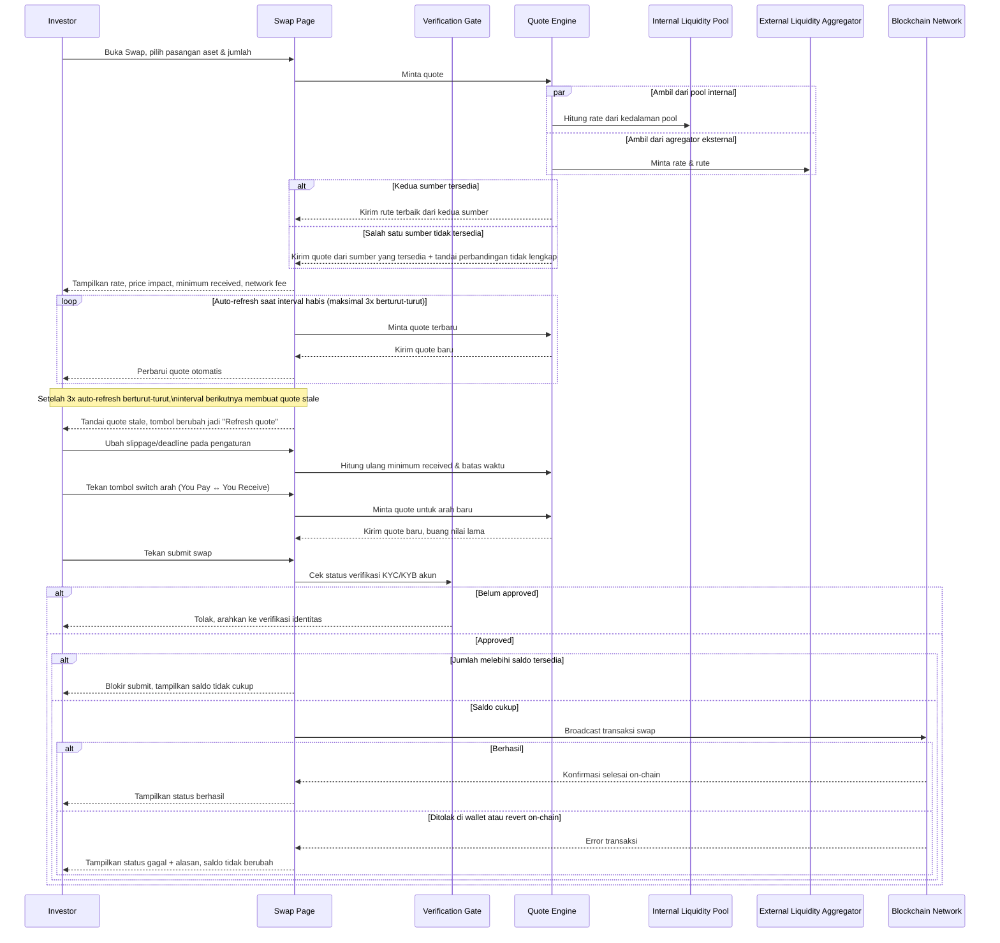

# Spec: Asset Swap

## LAYER 1 — Functional Specification

### Overview

Investor yang ingin menukar satu aset ke aset lain butuh quote yang wajar, transparan soal biayanya, dan eksekusi yang benar-benar tercatat di on-chain. Spec ini mendefinisikan fitur Swap: quote yang menggabungkan liquidity pool internal platform dan agregator likuiditas eksternal untuk mendapatkan rute terbaik, breakdown biaya (price impact, minimum received, network fee), pengaturan slippage/deadline, auto-refresh quote dengan batas percobaan, dan eksekusi swap sebagai transaksi on-chain sungguhan — semuanya hanya bisa dijalankan oleh akun yang status KYC/KYB-nya sudah approved.

### User Stories

1. As a verified investor, I want to swap one asset for another at a rate that combines internal and external liquidity, so that I get the best available execution price.
2. As an investor, I want to see a live, auto-refreshing quote with a clear cost breakdown, so that I understand exactly what I'll get before confirming.
3. As an investor, I want to adjust my slippage tolerance and transaction deadline, so that I can control how my swap executes under changing market conditions.
4. As an unverified investor, I want to be clearly guided to complete KYC before I can swap, so that I understand why the action is blocked.

### Functional Requirements

1. Sistem harus menghitung exchange rate dan estimasi jumlah yang diterima dengan menggabungkan kedalaman liquidity pool internal dan quote dari agregator likuiditas eksternal, memilih rute yang memberi hasil terbaik untuk investor.
2. Sistem harus menampilkan breakdown biaya untuk setiap swap — price impact, minimum received (berdasarkan slippage yang dipilih), dan network fee — sebelum investor mengonfirmasi.
3. Sistem harus menyegarkan quote secara otomatis ketika interval berlaku habis, hingga maksimal tiga kali berturut-turut; setelah itu quote ditandai stale dan investor harus menyegarkan secara manual sebelum dapat submit.
4. Sistem harus mengizinkan investor mengatur slippage tolerance dan deadline transaksi, dan menerapkan nilai tersebut pada perhitungan minimum received serta batas waktu eksekusi swap.
5. Sistem harus menampilkan peringatan ketika price impact suatu swap signifikan, tanpa memblokir investor untuk tetap melanjutkan submit pada besaran price impact berapapun.
6. Sistem harus menahan aksi swap untuk akun yang status verifikasi KYC/KYB-nya belum approved, menampilkan jalur untuk menyelesaikan verifikasi.
7. Sistem harus memvalidasi bahwa jumlah yang akan dibayarkan tidak melebihi saldo aset yang tersedia sebelum mengizinkan submit.
8. Sistem harus mem-broadcast swap yang dikonfirmasi sebagai transaksi on-chain sungguhan melalui smart contract/router, dan mencatat hasilnya (berhasil, ditolak di wallet, atau revert on-chain) setelah selesai.

### Acceptance Criteria

**Happy Path**
- [ ] GIVEN akun investor berstatus approved dan investor memilih pasangan aset serta jumlah yang valid, WHEN investor menekan konfirmasi swap, THEN sistem mem-broadcast transaksi swap dan menampilkan status berhasil begitu selesai di on-chain.
- [ ] GIVEN quote yang ditampilkan menggabungkan rate dari liquidity pool internal dan agregator eksternal, WHEN investor melihat exchange rate, THEN sistem menampilkan rute yang memberi jumlah estimasi terima tertinggi untuk jumlah yang dimasukkan.
- [ ] GIVEN interval quote habis untuk pertama, kedua, atau ketiga kalinya secara berturut-turut, WHEN interval tersebut habis, THEN sistem menyegarkan quote secara otomatis tanpa investor perlu menekan apapun.
- [ ] GIVEN investor mengubah slippage tolerance atau deadline transaksi pada pengaturan, WHEN nilai baru disimpan, THEN sistem memperbarui minimum received dan batas waktu eksekusi sesuai nilai tersebut pada quote berikutnya.
- [ ] GIVEN investor menekan tombol MAX pada kolom "You Pay", WHEN nilai terisi, THEN sistem mengisi jumlah dengan saldo penuh aset tersebut yang tersedia untuk swap.

**Error Cases**
- [ ] GIVEN akun investor belum berstatus approved, WHEN investor menekan tombol submit swap, THEN sistem mencegah aksi tersebut dan menampilkan jalur untuk menyelesaikan verifikasi identitas.
- [ ] GIVEN jumlah yang dimasukkan investor melebihi saldo aset yang tersedia, WHEN investor mencoba submit, THEN sistem memblokir submit dan menampilkan pesan saldo tidak cukup.
- [ ] GIVEN transaksi swap ditolak oleh investor di wallet atau revert di on-chain, WHEN kegagalan terdeteksi, THEN sistem menampilkan status gagal beserta alasannya dan tidak mengurangi saldo aset yang dibayarkan.

**Edge Cases**
- [ ] GIVEN quote telah melewati tiga kali auto-refresh berturut-turut, WHEN interval berikutnya habis, THEN sistem menandai quote sebagai stale dan memblokir submit sampai investor menyegarkan quote secara manual.
- [ ] GIVEN price impact suatu swap sangat tinggi, WHEN investor melihat ringkasan swap, THEN sistem menampilkan peringatan yang lebih tegas namun tetap mengizinkan investor melanjutkan submit.
- [ ] GIVEN investor menukar posisi "You Pay" dan "You Receive" (switch arah swap), WHEN switch dilakukan, THEN sistem menghitung ulang quote untuk arah baru tanpa mempertahankan nilai lama yang sudah tidak relevan.

**Infra/Config**
- [ ] GIVEN salah satu sumber quote (liquidity pool internal atau agregator eksternal) tidak dapat diakses, WHEN quote diminta, THEN sistem tetap menampilkan quote dari sumber yang tersedia dan menandai bahwa perbandingan rute tidak lengkap, bukan gagal total.

### Out of Scope

- Definisi/daftar agregator likuiditas eksternal spesifik yang diintegrasikan — follow-up spec integrasi liquidity provider.
- Riwayat transaksi swap sebagai tampilan tersendiri — sudah tercakup oleh Recent Transactions pada spec Portfolio, tidak diulang di sini.
- Batas nilai minimum/maksimum yang diizinkan untuk slippage tolerance dan deadline — follow-up spec kebijakan bisnis.
- Swap multi-hop lintas lebih dari dua aset dalam satu transaksi — follow-up bila dibutuhkan.
- Perhitungan detail komponen network fee (gas price dinamis, kongesti network) — follow-up spec teknis tersendiri.

---

## LAYER 2 — Technical Design

### Flow Diagram

### Data Model Changes

- **Transaction** (entitas yang sudah ada, didefinisikan pada spec Portfolio): diperluas untuk mendukung `type = trade` dengan atribut tambahan khusus swap.
  - `route` (`internal` | `external` | `combined`) — sumber quote yang dipakai saat eksekusi.
  - `slippageToleranceBps`, `deadlineMinutes` — parameter yang berlaku saat transaksi disubmit.
  - `priceImpactPct`, `minimumReceived` — nilai yang ditampilkan ke investor sebelum konfirmasi, disimpan untuk rekonsiliasi hasil.
- Constraint: pembuatan `Transaction` bertipe `trade` (swap) mensyaratkan akun terkait memiliki `VerificationSubmission` (didefinisikan pada spec KYC/KYB) dengan `status = approved`.

### Integration Mapping

| Sistem Eksternal | Arah Data | Data yang Dipertukarkan | Trigger |
|---|---|---|---|
| External Liquidity Aggregator | Masuk | Pasangan aset & jumlah yang diminta; rate, rute, dan estimasi hasil dari luar platform | Quote diminta pertama kali atau disegarkan (manual maupun auto-refresh) |
| Blockchain Network | Keluar | Instruksi transaksi swap (pasangan aset, jumlah, minimum received, deadline) | Investor mengonfirmasi submit swap |

### Error Handling

| Scenario | HTTP Status | Error Code | Retry-safe? |
|---|---|---|---|
| Submit swap dicoba sebelum status verifikasi approved | 403 | `VERIFICATION_REQUIRED` | Yes |
| Jumlah swap melebihi saldo yang tersedia | 422 | `INSUFFICIENT_BALANCE` | Yes |
| Submit dicoba dengan quote yang sudah stale | 409 | `QUOTE_STALE` | Yes |
| Transaksi swap ditolak oleh investor di wallet | 400 | `SWAP_REJECTED_IN_WALLET` | Yes |
| Transaksi swap revert di on-chain | 502 | `SWAP_REVERTED_ONCHAIN` | Yes |
