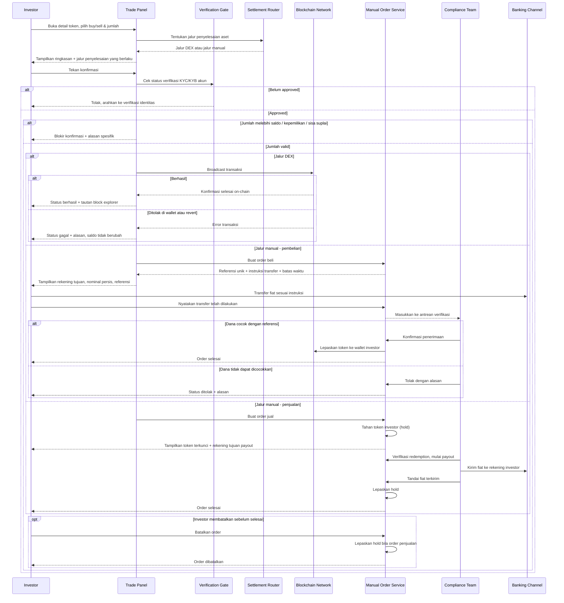

# Spec: Token Buy & Sell

## LAYER 1 — Functional Specification

### Overview

Tidak semua aset di Frakta bisa diselesaikan dengan cara yang sama. Token yang punya likuiditas on-chain dapat langsung dieksekusi ke DEX dan selesai dalam satu langkah. Sementara aset RWA — properti, karya seni, obligasi — tidak punya pasar on-chain yang dalam, sehingga penyelesaiannya harus lewat jalur manual: investor mentransfer fiat ke rekening kustodian, tim compliance memverifikasi dana masuk, baru token dilepas ke wallet investor. Untuk penjualan, arahnya berkebalikan — token investor ditahan lebih dulu, dan hold baru dilepas setelah fiat dikirim ke rekening investor.

Spec ini mendefinisikan panel buy/sell pada halaman detail token: bagaimana sistem memilih jalur penyelesaian berdasarkan karakteristik aset, bagaimana kedua jalur itu diinformasikan ke investor sebelum ia berkomitmen, dan bagaimana siklus hidup order manual dilacak sampai selesai. Sama seperti Swap, semua aksi hanya bisa dijalankan oleh akun yang status KYC/KYB-nya sudah approved.

### User Stories

1. As a verified investor, I want to know before I confirm whether an order settles instantly or requires a bank transfer, so that I am not surprised by a manual step after committing.
2. As an investor buying an RWA token, I want clear, copyable payment instructions with a unique reference, so that my transfer can be matched to my order without back-and-forth.
3. As an investor buying an RWA token, I want to see where my order stands between paying and receiving tokens, so that I am not left wondering whether my money arrived.
4. As an investor selling an RWA token, I want to understand that my tokens are locked during the redemption, so that I am not confused when I cannot trade them.
5. As an investor, I want to cancel a manual order that I no longer want before it is settled, so that I am not committed to a transaction indefinitely.
6. As an unverified investor, I want to be clearly guided to complete KYC before I can trade, so that I understand why the action is blocked.

### Functional Requirements

1. Sistem harus menentukan jalur penyelesaian setiap aset — eksekusi langsung ke DEX atau penyelesaian manual — berdasarkan atribut aset, tanpa investor perlu memilih jalur secara manual.
2. Sistem harus memberi tahu investor jalur penyelesaian yang akan dipakai beserta konsekuensinya pada layar konfirmasi, sebelum investor menekan tombol konfirmasi.
3. Sistem harus mengeksekusi order pada aset berjalur DEX sebagai transaksi on-chain dan menampilkan hasilnya beserta tautan ke block explorer setelah selesai.
4. Sistem harus membuat order dengan referensi unik untuk setiap pembelian pada aset berjalur manual, dan menampilkan instruksi transfer bank yang memuat detail rekening tujuan, nominal persis yang harus ditransfer, dan referensi order tersebut.
5. Sistem harus menetapkan batas waktu pembayaran untuk setiap order pembelian manual, dan menampilkan sisa waktu tersebut kepada investor selama order masih terbuka.
6. Sistem harus menyediakan cara bagi investor untuk menyatakan bahwa transfer telah dilakukan, yang memindahkan order ke antrean verifikasi tim compliance.
7. Sistem harus menahan token investor pada setiap penjualan berjalur manual sejak order dibuat, dan menjaga token tersebut tidak dapat diperdagangkan selama order masih terbuka.
8. Sistem harus melepaskan token ke wallet investor (untuk pembelian) atau melepaskan hold dan mengirim fiat ke rekening investor (untuk penjualan) hanya setelah tim compliance menyelesaikan verifikasi.
9. Sistem harus menampilkan posisi order manual saat ini di antara seluruh tahapan jalurnya, sehingga investor selalu tahu langkah mana yang sedang berjalan dan apa yang terjadi berikutnya.
10. Sistem harus mengizinkan investor membatalkan order manual yang belum selesai, dan melepaskan hold token pada order penjualan yang dibatalkan.
11. Sistem harus menahan aksi buy/sell untuk akun yang status verifikasi KYC/KYB-nya belum approved, menampilkan jalur untuk menyelesaikan verifikasi.
12. Sistem harus memvalidasi bahwa jumlah pembelian tidak melebihi saldo pembayaran yang tersedia maupun sisa suplai penawaran, dan jumlah penjualan tidak melebihi kepemilikan investor.

### Acceptance Criteria

**Happy Path**
- [ ] GIVEN investor berstatus approved membeli aset berjalur DEX dengan jumlah valid, WHEN investor mengonfirmasi order, THEN sistem mem-broadcast transaksi on-chain dan menampilkan status berhasil beserta tautan block explorer.
- [ ] GIVEN investor berstatus approved membeli aset berjalur manual dengan jumlah valid, WHEN investor mengonfirmasi order, THEN sistem membuat order dengan referensi unik dan menampilkan instruksi transfer berisi detail rekening, nominal persis, dan referensi tersebut.
- [ ] GIVEN order pembelian manual sedang menunggu pembayaran, WHEN investor menyatakan transfer telah dilakukan, THEN sistem memindahkan order ke tahap verifikasi tim compliance.
- [ ] GIVEN tim compliance mengonfirmasi dana pembelian telah diterima, WHEN konfirmasi diselesaikan, THEN sistem melepaskan token ke wallet investor dan menandai order selesai.
- [ ] GIVEN investor berstatus approved menjual aset berjalur manual, WHEN investor mengonfirmasi order, THEN sistem menahan token yang dijual dan menampilkan bahwa token tersebut terkunci selama order berjalan.
- [ ] GIVEN tim compliance telah mengirim fiat hasil penjualan ke rekening investor, WHEN pengiriman diselesaikan, THEN sistem melepaskan hold token dan menandai order selesai.
- [ ] GIVEN investor melihat layar konfirmasi untuk aset berjalur manual, WHEN layar ditampilkan, THEN sistem menjelaskan bahwa penyelesaian dilakukan di luar rantai beserta langkah yang akan diminta setelah konfirmasi.

**Error Cases**
- [ ] GIVEN akun investor belum berstatus approved, WHEN investor menekan tombol buy atau sell, THEN sistem mencegah aksi tersebut dan menampilkan jalur untuk menyelesaikan verifikasi identitas.
- [ ] GIVEN jumlah pembelian melebihi saldo pembayaran yang tersedia, WHEN investor mencoba konfirmasi, THEN sistem memblokir konfirmasi dan menjelaskan bahwa saldo tidak mencukupi.
- [ ] GIVEN jumlah penjualan melebihi kepemilikan investor atas aset tersebut, WHEN investor mencoba konfirmasi, THEN sistem memblokir konfirmasi dan menjelaskan kepemilikan tidak mencukupi.
- [ ] GIVEN tim compliance tidak dapat mencocokkan transfer masuk dengan referensi order, WHEN order ditolak, THEN sistem menampilkan status ditolak beserta alasannya kepada investor.
- [ ] GIVEN transaksi pada aset berjalur DEX ditolak di wallet atau revert on-chain, WHEN kegagalan terdeteksi, THEN sistem menampilkan status gagal beserta alasannya dan saldo investor tidak berubah.

**Edge Cases**
- [ ] GIVEN order pembelian manual sudah berstatus selesai, WHEN investor atau sistem mencoba menyatakan pembayaran ulang pada order yang sama, THEN sistem menolak aksi tersebut karena order tidak lagi berada pada tahap yang menerimanya.
- [ ] GIVEN order manual telah mencapai tahap akhir — selesai, dibatalkan, ditolak, atau kedaluwarsa, WHEN investor melihat order tersebut, THEN sistem tidak lagi menampilkan instruksi pembayaran, agar tidak terbaca sebagai permintaan transfer kedua.
- [ ] GIVEN investor membatalkan order penjualan manual sebelum payout dimulai, WHEN pembatalan diproses, THEN sistem melepaskan hold sehingga token kembali dapat diperdagangkan.
- [ ] GIVEN batas waktu pembayaran suatu order pembelian manual telah terlewat, WHEN sisa waktu habis, THEN sistem menandai jendela pembayaran telah tertutup.
- [ ] GIVEN suatu penawaran berjalur manual sudah habis terserap seluruhnya, WHEN investor mencoba membelinya, THEN sistem menolak pembuatan order karena penawaran telah penuh.
- [ ] GIVEN suatu aset belum memiliki harga, WHEN investor mencoba membuat order atas aset tersebut, THEN sistem menolak karena aset belum dapat diperdagangkan.

**Infra/Config**
- [ ] GIVEN layanan order manual tidak dapat diakses saat investor mengonfirmasi, WHEN kegagalan terjadi, THEN sistem menampilkan kegagalan beserta opsi mencoba ulang, dan tidak membuat order ganda ketika investor mencoba lagi.
- [ ] GIVEN aset berjalur DEX dikirim ke kanal order manual, WHEN permintaan diterima, THEN sistem menolaknya sebagai jalur yang tidak sesuai untuk aset tersebut.

### Out of Scope

- Antarmuka back office untuk tim compliance memverifikasi transfer masuk dan melepas token — follow-up spec admin console. Spec ini hanya mendefinisikan sisi investor dan transisi status yang dihasilkannya.
- Rekonsiliasi otomatis transfer masuk dengan referensi order (virtual account per order) — follow-up spec integrasi payment gateway.
- Kebijakan bisnis untuk besaran batas waktu pembayaran, nominal minimum order, dan aturan kedaluwarsa — follow-up spec kebijakan.
- Riwayat order manual sebagai tampilan tersendiri — akan disatukan dengan Transaction History, follow-up.
- Konversi kurs fiat non-USD untuk rekening tujuan maupun payout — follow-up spec multi-currency.
- Swap token↔token — sudah tercakup pada spec Asset Swap, tidak diulang di sini.

---

## LAYER 2 — Technical Design

### Flow Diagram

### Data Model Changes

- **Asset** (entitas yang sudah ada): atribut `executionMode` menentukan jalur penyelesaian — nilai berjalur DEX dieksekusi on-chain, nilai berjalur manual dirutekan ke Manual Order Service. Atribut ini yang dipakai Settlement Router, bukan pilihan investor.
- **ManualOrder** (entitas baru): merepresentasikan satu order yang penyelesaiannya di luar rantai.
  - `reference` — kode unik yang dicantumkan investor pada transfer; kunci pencocokan dana masuk.
  - `side` (`buy` | `sell`), `qty`, `pricePerToken`, `amountUsd`, `feeUsd` — isi order, dikunci saat order dibuat.
  - `status` — posisi pada siklus hidup. Pembelian: `awaiting_payment` → `payment_review` → `settled`. Penjualan: `on_hold` → `payout_review` → `settled`. Status akhir lain: `rejected`, `cancelled`, `expired`.
  - `expiresAt` — batas jendela pembayaran; hanya berlaku untuk order pembelian.
  - `rejectionReason` — terisi saat tim compliance menolak, ditampilkan ke investor.
  - `createdAt`, `settledAt` — jejak waktu untuk rekonsiliasi.
- **Holding** (entitas yang sudah ada, didefinisikan pada spec Portfolio): memerlukan konsep jumlah tertahan (hold) agar token pada order penjualan manual yang masih berjalan tidak ikut terhitung sebagai saldo yang dapat diperdagangkan.
- Constraint: pembuatan `ManualOrder` mensyaratkan akun terkait memiliki `VerificationSubmission` (didefinisikan pada spec KYC/KYB) dengan `status = approved`.
- Constraint: transisi status `ManualOrder` hanya sah dari tahap yang mendahuluinya; order yang sudah mencapai status akhir tidak dapat ditransisikan lagi.

### Integration Mapping

| Sistem Eksternal | Arah Data | Data yang Dipertukarkan | Trigger |
|---|---|---|---|
| Blockchain Network | Keluar | Instruksi transaksi buy/sell untuk aset berjalur DEX | Investor mengonfirmasi order pada aset berjalur DEX |
| Blockchain Network | Keluar | Instruksi transfer token ke wallet investor | Tim compliance mengonfirmasi penerimaan dana pembelian manual |
| Banking Channel | Masuk | Transfer fiat masuk beserta referensi order | Investor melakukan transfer sesuai instruksi pembayaran |
| Banking Channel | Keluar | Payout fiat ke rekening terdaftar investor | Tim compliance menyelesaikan verifikasi order penjualan manual |

### Error Handling

| Scenario | HTTP Status | Error Code | Retry-safe? |
|---|---|---|---|
| Order dicoba sebelum status verifikasi approved | 403 | `VERIFICATION_REQUIRED` | Yes |
| Jumlah pembelian melebihi saldo pembayaran tersedia | 422 | `INSUFFICIENT_BALANCE` | Yes |
| Jumlah penjualan melebihi kepemilikan investor | 422 | `INSUFFICIENT_HOLDING` | Yes |
| Jumlah order tidak valid (nol atau negatif) | 400 | `INVALID_QTY` | Yes |
| Aset berjalur DEX dikirim ke kanal order manual | 400 | `NOT_MANUAL` | No |
| Order dibuat atas aset yang belum memiliki harga | 400 | `NOT_PRICED` | No |
| Pembelian dicoba pada penawaran yang sudah habis terserap | 409 | `SOLD_OUT` | No |
| Transisi status dicoba dari tahap yang tidak sah | 409 | `BAD_STATE` | No |
| Order yang dirujuk tidak ditemukan | 404 | `ORDER_NOT_FOUND` | No |
| Transaksi aset berjalur DEX ditolak di wallet | 400 | `TRADE_REJECTED_IN_WALLET` | Yes |
| Transaksi aset berjalur DEX revert di on-chain | 502 | `TRADE_REVERTED_ONCHAIN` | Yes |
